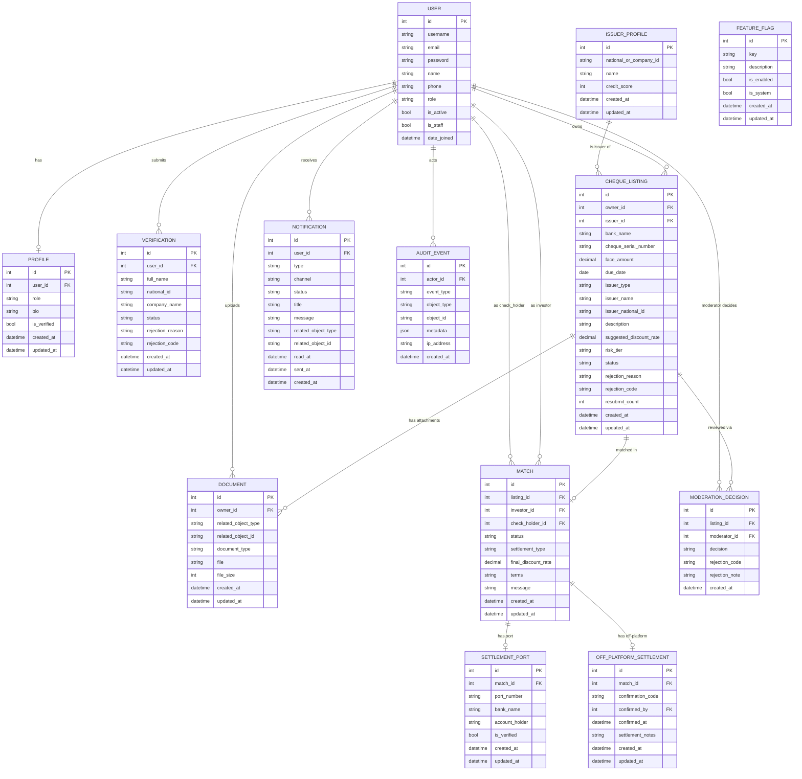
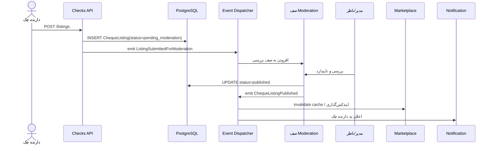
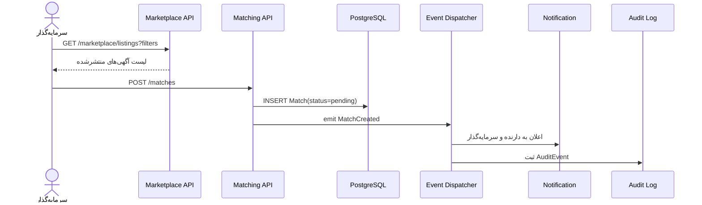

# Cheque Platform Low-Level Design
## چک‌یار (Cheque Yar) — لایه ۱ Marketplace

> ادامهٔ منطقی [`cheque-platform-technical-architecture.md.md`](cheque-platform-technical-architecture.md.md).  
> **قرارداد API زنده (SSOT):** [`docs/development/MASTER_API_CONTRACT.md`](development/MASTER_API_CONTRACT.md) — این LLD نگاشت معماری است؛ جزئیات فیلد/کد خطا را از قرارداد استخراج کنید نه از این جدول.

**به‌روزرسانی وضعیت:** ۱۴۰۵/۰۵/۲۳ (2026-08-14) — لایه ۱ در `backend/doion/` پیاده‌سازی شده است. UI فعال در ریپوی خارجی `checkyar-googleai` است، نه در `frontend/` این مونورپو.

**پشته واقعی:** Python 3.12، Django 5.2، DRF، SimpleJWT (access ۱ ساعت؛ refresh پیش‌فرض ۱ روز)، PostgreSQL در تولید / SQLite در توسعه، Redis + Celery برای jobها، structlog + correlation id.

**شناسه‌ها:** PKها `BigAutoField` هستند، نه UUID.

## ۱. دلیل انتخاب پشته فنی

Django به‌خاطر سه ویژگی آماده‌ی خود برای این فاز مناسب‌تر از FastAPI است:

- **Admin Panel آماده** → دقیقاً معادل نیاز ماژول `Moderation & Admin` (بررسی دستی آگهی پیش از انتشار) بدون نیاز به ساخت رابط کاربری جدا.
- **Auth/Permission/ORM/Migrations آماده** → نیاز ماژول‌های `Identity & KYC` و لایه‌ی داده را با کمترین کد سفارشی پوشش می‌دهد.
- **ساختار App-based** → نگاشت طبیعی به مرزهای ماژولار سند سطح بالا (هر `app` دیجانگو = یک bounded context).

اگر در آینده بخشی (مثلاً موتور قیمت‌گذاری در لایه ۳) به سرویس async پرسرعت و مستقل نیاز پیدا کند، همان بخش با FastAPI به‌صورت سرویس جدا استخراج می‌شود — این دقیقاً همان مسیر «استخراج ماژول» است که در بخش ۳ سند سطح بالا توضیح داده شده.

## ۲. ساختار پروژه (نگاشت ماژول‌ها به Django Apps)

ساختار هدف LLD اولیه `backend/apps/` بود؛ **تصمیم اجرایی:** appهای دامنه زیر `backend/doion/` هم‌راستا با Cookiecutter (`users`) ساخته شدند. مهاجرت فیزیکی به `apps/` پس از MVP انجام نشده و در برنامه جاری نیست.

```
backend/
├── config/                  # settings, urls, asgi/wsgi, celery.py, api_router.py
├── doion/
│   ├── core/                 # TimeStampedModel، permission classes، seed_demo
│   ├── users/                # User سفارشی، JWT login/refresh
│   ├── identity/             # Profile, Verification, register/me
│   ├── documents/            # Document (سرویس مشترک مدارک)
│   ├── pricing/              # موتور stub نرخ پیشنهادی / risk_tier
│   ├── checks/               # ChequeListing, IssuerProfile
│   ├── marketplace/          # فیلتر و لیست published + latest
│   ├── matching/             # Match, SettlementPort model, OffPlatformSettlement
│   ├── moderation/           # صف آگهی و KYC + decision
│   ├── notifications/        # Notification, NotificationPreference
│   ├── compliance/           # AuditEvent, FeatureFlag, stats
│   └── integrations/         # SMS stub (SMSLog)
├── pyproject.toml
└── uv.lock
```

**نکته نسبت به سند سطح بالا (بخش ۷):** Django همه جدول‌ها را در schema عمومی `public` با نام `app_label_modelname` می‌گذارد. برای MVP از همین پیش‌فرض استفاده شده؛ schema فیزیکی جدا ساخته نشده است.

---

## ۳. مدل داده دقیق



**محدودیت‌های کلیدی (سطح migration):**
- `UniqueConstraint` روی `(issuer, bank_name, cheque_serial_number)` در `ChequeListing` (فیلد FK صادرکننده، نه `national_or_company_id` به‌تنهایی).
- `status` در `ChequeListing` و `Match` به‌صورت `TextChoices`.
- `Match.settlement_type` پیش‌فرض `"off_platform"`؛ مقادیر `escrow` و `principal_ledger` رزرو شده‌اند.
- `Profile.user_type`: `natural` | `legal` (جایگزین نقش جداگانه InstitutionalInvestor).

---

## ۴. قرارداد API (DRF — بخش‌های اصلی)

جدول زیر نمای کلی است. شکل دقیق request/response و کد خطا فقط در [`MASTER_API_CONTRACT.md`](development/MASTER_API_CONTRACT.md) معتبر است.

| متد | مسیر | نقش مجاز | توضیح |
|---|---|---|---|
| POST | `/api/v1/auth/login/` | عمومی | دریافت JWT (SimpleJWT) |
| POST | `/api/v1/auth/refresh/` | عمومی | تمدید access token |
| POST | `/api/v1/identity/register/` | عمومی | ثبت‌نام + ایجاد User + Profile |
| GET/PATCH | `/api/v1/users/me/` | کاربر احرازشده | مشاهده/ویرایش اطلاعات کاربر |
| GET/PATCH | `/api/v1/identity/profile/` | کاربر احرازشده | مشاهده/ویرایش پروفایل |
| POST | `/api/v1/verifications/` | کاربر احرازشده | شروع فرایند KYC |
| GET | `/api/v1/verifications/me/` | کاربر احرازشده | آخرین درخواست KYC کاربر |
| GET | `/api/v1/verifications/` | کاربر احرازشده | لیست درخواست‌های KYC |
| POST | `/api/v1/listings/` | CheckHolder | ثبت آگهی چک (status=pending_moderation) |
| GET/PATCH | `/api/v1/listings/{id}/` | CheckHolder (مالک) | مشاهده/ویرایش آگهی |
| POST | `/api/v1/listings/{id}/documents/` | CheckHolder (مالک) | بارگذاری مدارک |
| POST | `/api/v1/listings/{id}/withdraw/` | CheckHolder (مالک) | پس‌گرفتن آگهی |
| GET | `/api/v1/listings/my/` | CheckHolder | آگهی‌های من |
| GET | `/api/v1/marketplace/listings/` | همه | جست‌وجو/فیلتر آگهی‌های `published` |
| GET | `/api/v1/issuer-profiles/` | همه | لیست پروفایل‌های صادرکننده |
| GET/PATCH | `/api/v1/issuer-profiles/{id}/` | CheckHolder (مالک) | مشاهده/ویرایش پروفایل |
| POST | `/api/v1/matches/` | Investor | ابراز تمایل (ایجاد Match) |
| GET | `/api/v1/matches/` | کاربر احرازشده | لیست Matchهای کاربر (فیلتر بر اساس نقش) |
| GET | `/api/v1/matches/my/` | کاربر احرازشده | تطابق‌های من (همانند `/matches/` با فیلتر نقش) |
| PATCH | `/api/v1/matches/{id}/status/` | طرفین Match | بروزرسانی وضعیت (`status`, `final_discount_rate?`, `terms?`) |
| POST | `/api/v1/matches/{id}/accept/` | check_holder | پذیرش تطابق |
| POST | `/api/v1/matches/{id}/decline/` | check_holder | رد تطابق |
| POST | `/api/v1/matches/{id}/cancel/` | طرفین Match | لغو تطابق |
| POST | `/api/v1/matches/{id}/confirm-off-platform/` | check_holder | تأیید تسویه بیرون از پلتفرم |
| GET | `/api/v1/marketplace/listings/latest/` | عمومی | ۴ آگهی آخر منتشر شده |
| GET | `/api/v1/moderation/queue/` | Moderator | صف آگهی‌های در انتظار بررسی |
| POST | `/api/v1/moderation/{id}/resubmit/` | CheckHolder | ارسال مجدد آگهی رد شده |
| GET | `/api/v1/moderation/kyc/` | Moderator | صف درخواست‌های KYC |
| POST | `/api/v1/moderation/kyc/{id}/decision/` | Moderator | تأیید/رد KYC |
| GET | `/api/v1/notifications/` | کاربر احرازشده | لیست اعلان‌ها |
| PATCH | `/api/v1/notifications/{id}/` | کاربر احرازشده | علامت‌گذاری خوانده‌شده |
| POST | `/api/v1/notifications/mark-all-read/` | کاربر احرازشده | علامت‌گذاری همه خوانده‌شده |
| GET | `/api/v1/notifications/preferences/` | کاربر احرازشده | تنظیمات اعلان |
| PATCH | `/api/v1/notifications/preferences/` | کاربر احرازشده | بروزرسانی تنظیمات |
| GET | `/api/v1/compliance/feature-flags/` | Admin/Moderator | لیست Feature Flags |
| GET/PATCH | `/api/v1/compliance/feature-flags/{key}/` | Admin | مشاهده/تغییر Feature Flag |
| POST | `/api/v1/compliance/feature-flags/{key}/toggle/` | Admin | تغییر وضعیت Feature Flag |
| GET | `/api/v1/compliance/stats/` | Admin/Moderator | آمار داشبورد |
| GET | `/api/v1/compliance/audit/` | Admin/Moderator | لیست رویدادهای审计 |

---

## ۵. کاتالوگ رویدادها (پیاده‌سازی گذرگاه رویداد در Django)

مکانیزم: **Django Signals** برای ارتباط هم‌زمان (in-process) بین appها، و **Celery task** برای کارهایی که نباید درخواست HTTP را کند کنند (ارسال SMS، محاسبه نرخ سنگین). هر app سیگنال‌های خودش را در `events.py` تعریف می‌کند؛ مشترکین در متد `ready()` فایل `apps.py` ثبت می‌شوند.

| رویداد | ناشر | مشترکین | نوع پردازش |
|---|---|---|---|
| `VerificationApproved` | identity | compliance (audit) | sync |
| `ListingSubmittedForModeration` | checks | moderation | sync |
| `ChequeListingPublished` | moderation | marketplace (cache)، matching/notification، compliance | async (Celery) برای notification |
| `MatchCreated` | matching | notification، compliance، *(آینده: escrow در لایه ۲)* | async |
| `FeatureFlagChanged` | compliance | تمام appهایی که flag را cache می‌کنند | sync (invalidate cache) |

این جدول دقیقاً پیاده‌سازی بخش ۴.۵ سند سطح بالا است. وقتی زمان استخراج یک app به سرویس مستقل برسد، فقط محل ثبت signal با subscribe روی یک Message Broker واقعی (RabbitMQ/Kafka) جایگزین می‌شود؛ امضای ناشر دست‌نخورده می‌ماند.

---

## ۶. دنباله‌ی عملیات کلیدی

### 6.1 ثبت و انتشار آگهی



### 6.2 ایجاد تطبیق (Match)



---

## ۷. پیاده‌سازی Settlement Port (بخش ۵.۲ سند سطح بالا)

لایه ۱ با مدل‌های `SettlementPort` و `OffPlatformSettlement` در `doion.matching` پیاده شده است. تأیید تسویه از طریق `POST /api/v1/matches/{id}/confirm-off-platform/` ثبت می‌شود؛ وجه جابه‌جا نمی‌شود.

مسیر مفهومی قدیمی `apps/core/settlement.py` و تنظیم `SETTLEMENT_BACKEND` در کد فعلی استفاده نشده. گسترش به escrow در لایه ۲ باید همان app `matching` را از طریق پیاده‌سازی جدید Port گسترش دهد، نه با بازنویسی `ChequeListing`.

---

## ۸. احراز هویت و کنترل دسترسی

- **JWT:** `djangorestframework-simplejwt` — access token ۱ ساعت؛ refresh token ۱ روز (پیش‌فرض SimpleJWT؛ در settings override نشده).
- **نقش‌ها:** `check_holder`, `investor`, `moderator`, `admin` (روی User/Profile و Django Groups). ثبت‌نام API فقط دو نقش اول را می‌پذیرد.
- **نوع کاربر:** `Profile.user_type` = `natural` | `legal` — نقش InstitutionalInvestor جداگانه پیاده نشده.
- **Permission Classes:** `IsCheckHolder`, `IsInvestor`, `IsModerator` و کنترل مالکیت آگهی.

| عملیات | CheckHolder | Investor | Moderator | Admin |
|---|---|---|---|---|
| ثبت آگهی | ✅ | ❌ | ❌ | ❌ |
| مشاهده آگهی‌های منتشرشده | ✅ | ✅ | ✅ | ✅ |
| ایجاد Match | ❌ | ✅ | ❌ | ❌ |
| تایید/رد آگهی | ❌ | ❌ | ✅ | ✅ |
| تغییر Feature Flag | ❌ | ❌ | ❌ | ✅ |

---

## ۹. مدیریت خطا و اعتبارسنجی

- اعتبارسنجی فیلد و قواعد کسب‌وکار (مثل `due_date` باید در آینده باشد، `face_amount > 0`) در DRF Serializer.
- فرمت یکنواخت خطا از طریق `exception_handler` سفارشی:
```json
{"error": {"code": "VALIDATION_ERROR", "message": "...", "details": {"due_date": ["باید در آینده باشد"]}}}
```
- جلوگیری از ثبت تکراری از طریق `unique_together` در سطح دیتابیس (بخش ۳)، نه فقط چک در سطح برنامه.

---

## ۱۰. مشخصات غیرکارکردی

- **Rate Limiting:** DRF Throttling — عمومی ۱۰۰ درخواست/دقیقه، ثبت آگهی ۱۰ درخواست/روز به ازای هر کاربر.
- **Logging:** JSON ساخت‌یافته (`structlog`) + `correlation_id` به ازای هر درخواست (middleware).
- **Cache:** Redis برای نتایج جست‌وجوی Marketplace (TTL کوتاه) و مقادیر Feature Flag.
- **Background Jobs:** Celery + Redis broker — برای ارسال اعلان‌ها، انقضای خودکار آگهی‌های گذشته از سررسید، و پردازش رویدادهای async.

---

## ۱۱. نقشه استقرار (MVP)

**توسعه محلی:** Django `runserver` + UI با Bun روی `127.0.0.1:3000`؛ دمو با `seed_demo` و در صورت نیاز SQLite جدا (`DJANGO_DEMO_DATABASE=1`).

**تولید هدف (چابکان):** سرویس جدا برای API (`chequeyar-back`) و SPA روی PaaS **Static** (`chequeyar-front`، دامنه https://royasoft.dev). جزئیات: [`PRODUCTION_CHABOKAN_DEPLOY.md`](development/PRODUCTION_CHABOKAN_DEPLOY.md).

docker-compose کامل با nginx در این مونورپو مسیر اصلی استقرار فعلی نیست.

## ۱۲. جمع‌بندی

پنج ماژول سند سطح بالا به appهای `backend/doion/` نگاشت شده‌اند. Settlement در لایه ۱ off-platform است. قرارداد زنده API در MASTER_API_CONTRACT است. UI در مونورپو نیست تا زمان مهاجرت از AI Studio.
