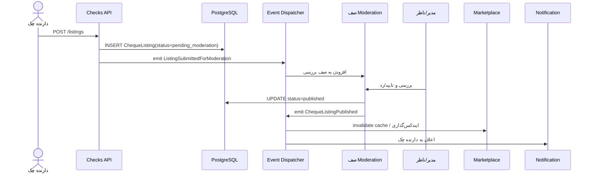
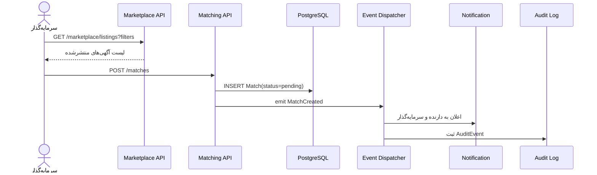

# Cheque Platform Low-Level Design
## پلتفرم اتصال دارندگان چک و سرمایه‌گذاران — لایه ۱

> این سند ادامه‌ی منطقی `cheque-platform-technical-architecture.md` (سند سطح بالا) است و باید همراه با آن خوانده شود. هر بخش از این سند مستقیماً به یک بخش از سند سطح بالا ارجاع می‌دهد. جزئیات بسیار دقیق‌تر (مثل JSON Schema کامل هر endpoint، فایل‌های migration واقعی، تست‌ها) در سند بعدی (سطح بسیار پایین) خواهد آمد.

**پشته فنی:** Python 3.12، Django 5.x، Django REST Framework (DRF)، PostgreSQL، Redis، Celery.

## ۱. دلیل انتخاب پشته فنی

Django به‌خاطر سه ویژگی آماده‌ی خود برای این فاز مناسب‌تر از FastAPI است:

- **Admin Panel آماده** → دقیقاً معادل نیاز ماژول `Moderation & Admin` (بررسی دستی آگهی پیش از انتشار) بدون نیاز به ساخت رابط کاربری جدا.
- **Auth/Permission/ORM/Migrations آماده** → نیاز ماژول‌های `Identity & KYC` و لایه‌ی داده را با کمترین کد سفارشی پوشش می‌دهد.
- **ساختار App-based** → نگاشت طبیعی به مرزهای ماژولار سند سطح بالا (هر `app` دیجانگو = یک bounded context).

اگر در آینده بخشی (مثلاً موتور قیمت‌گذاری در لایه ۳) به سرویس async پرسرعت و مستقل نیاز پیدا کند، همان بخش با FastAPI به‌صورت سرویس جدا استخراج می‌شود — این دقیقاً همان مسیر «استخراج ماژول» است که در بخش ۳ سند سطح بالا توضیح داده شده.

## ۲. ساختار پروژه (نگاشت ماژول‌ها به Django Apps)

```
backend/
├── config/                  # settings, urls, asgi/wsgi, celery.py
├── apps/
│   ├── core/                 # کلاس‌های پایه، Event Dispatcher، Settlement Port
│   ├── identity/              # Identity & KYC  → User, Profile, Verification
│   ├── documents/             # سرویس مشترک مدارک (نه ماژول کسب‌وکاری مستقل)
│   ├── pricing/               # موتور ریسک/نرخ تنزیل (مستقل و قابل‌استفاده در لایه ۲/۳)
│   ├── checks/                 # Check Registry → ChequeListing, IssuerProfile
│   ├── marketplace/            # Listing & Search → فقط View/Filter روی ChequeListing
│   ├── matching/               # Matching & Notification → Match, Notification
│   ├── moderation/             # Moderation & Admin → ModerationDecision + Admin
│   ├── compliance/                # عرضی: Audit & Compliance → AuditEvent, FeatureFlag
│   └── integrations/               # Integration Layer → adapterهای بیرونی
├── requirements/
└── docker/
```

**نکته‌ی فنی نسبت به سند سطح بالا (بخش ۷):** Django به‌صورت پیش‌فرض همه‌ی جدول‌ها را در schema عمومی `public` با نام‌گذاری `app_label_modelname` قرار می‌دهد، نه در schemaهای فیزیکی جدا. برای MVP پیشنهاد می‌کنم به‌جای schema فیزیکی جدا (که نیاز به پکیج‌های اضافه مثل `django-db-multitenant` یا router دستی دارد)، از همین مکانیزم پیش‌فرض استفاده شود؛ مرز منطقی bounded context همچنان از طریق app حفظ می‌شود و در آینده در صورت نیاز، هر app بدون تغییر مدل دامنه به schema یا سرویس مستقل منتقل می‌شود.

---

## ۳. مدل داده دقیق


**محدودیت‌های کلیدی (سطح migration، نه فقط منطق برنامه):**
- `unique_together` روی `(issuer.national_or_company_id, bank_name, cheque_serial_number)` در `ChequeListing` برای جلوگیری از ثبت تکراری (مطابق بخش ۶ سند سطح بالا).
- `status` در `ChequeListing` و `Match` به‌صورت `TextChoices` در Django تعریف می‌شود، نه boolean پراکنده، تا گسترش state machine در لایه ۲/۳ بدون migration مخرب ممکن باشد.
- `Match.settlement_type` مقدار پیش‌فرض `"off_platform"` با `choices` باز برای افزودن `"escrow"`, `"principal_ledger"` بعداً.

---

## ۴. قرارداد API (DRF — بخش‌های اصلی)

| متد | مسیر | نقش مجاز | توضیح |
|---|---|---|---|
| POST | `/api/v1/auth/login/` | عمومی | دریافت JWT (SimpleJWT) |
| POST | `/api/v1/auth/refresh/` | عمومی | تمدید access token |
| POST | `/api/v1/identity/register/` | عمومی | ثبت‌نام + ایجاد User + Profile |
| GET/PATCH | `/api/v1/users/me/` | کاربر احرازشده | مشاهده/ویرایش اطلاعات کاربر |
| GET/PATCH | `/api/v1/identity/profile/` | کاربر احرازشده | مشاهده/ویرایش پروفایل |
| POST | `/api/v1/verifications/` | کاربر احرازشده | شروع فرایند KYC |
| GET | `/api/v1/verifications/me/` | کاربر احرازشده | آخرین درخواست KYC کاربر |
| GET | `/api/v1/verifications/` | کاربر احرازشده | لیست درخواست‌های KYC |
| POST | `/api/v1/listings/` | CheckHolder | ثبت آگهی چک (status=pending_moderation) |
| GET/PATCH | `/api/v1/listings/{id}/` | CheckHolder (مالک) | مشاهده/ویرایش آگهی |
| POST | `/api/v1/listings/{id}/documents/` | CheckHolder (مالک) | بارگذاری مدارک |
| POST | `/api/v1/listings/{id}/withdraw/` | CheckHolder (مالک) | پس‌گرفتن آگهی |
| GET | `/api/v1/listings/my/` | CheckHolder | آگهی‌های من |
| GET | `/api/v1/marketplace/listings/` | همه | جست‌وجو/فیلتر آگهی‌های `published` |
| GET | `/api/v1/issuer-profiles/` | همه | لیست پروفایل‌های صادرکننده |
| GET/PATCH | `/api/v1/issuer-profiles/{id}/` | CheckHolder (مالک) | مشاهده/ویرایش پروفایل |
| POST | `/api/v1/matches/` | Investor | ابراز تمایل (ایجاد Match) |
| GET | `/api/v1/matches/` | کاربر احرازشده | لیست Matchهای کاربر |
| PATCH | `/api/v1/matches/{id}/status/` | طرفین Match | بروزرسانی وضعیت |
| POST | `/api/v1/matches/{id}/confirm-off-platform/` | طرفین Match | تأیید تسویه بیرون از پلتفرم |
| GET | `/api/v1/moderation/queue/` | Moderator | صف آگهی‌های در انتظار بررسی |
| POST | `/api/v1/moderation/{id}/decision/` | Moderator | تأیید/رد آگهی |
| POST | `/api/v1/moderation/{id}/resubmit/` | CheckHolder | ارسال مجدد آگهی رد شده |
| GET | `/api/v1/moderation/kyc/` | Moderator | صف درخواست‌های KYC |
| POST | `/api/v1/moderation/kyc/{id}/decision/` | Moderator | تأیید/رد KYC |
| GET | `/api/v1/notifications/` | کاربر احرازشده | لیست اعلان‌ها |
| PATCH | `/api/v1/notifications/{id}/` | کاربر احرازشده | علامت‌گذاری خوانده‌شده |
| POST | `/api/v1/notifications/mark-all-read/` | کاربر احرازشده | علامت‌گذاری همه خوانده‌شده |
| GET | `/api/v1/notifications/preferences/` | کاربر احرازشده | تنظیمات اعلان |
| PATCH | `/api/v1/notifications/preferences/` | کاربر احرازشده | بروزرسانی تنظیمات |
| GET | `/api/v1/compliance/feature-flags/` | Admin/Moderator | لیست Feature Flags |
| GET/PATCH | `/api/v1/compliance/feature-flags/{key}/` | Admin | مشاهده/تغییر Feature Flag |
| GET | `/api/v1/compliance/stats/` | Admin/Moderator | آمار داشبورد |
| GET | `/api/v1/compliance/audit/` | Admin/Moderator | لیست رویدادهای审计 |

---

## ۵. کاتالوگ رویدادها (پیاده‌سازی گذرگاه رویداد در Django)

مکانیزم: **Django Signals** برای ارتباط هم‌زمان (in-process) بین appها، و **Celery task** برای کارهایی که نباید درخواست HTTP را کند کنند (ارسال SMS، محاسبه نرخ سنگین). هر app سیگنال‌های خودش را در `events.py` تعریف می‌کند؛ مشترکین در متد `ready()` فایل `apps.py` ثبت می‌شوند.

| رویداد | ناشر | مشترکین | نوع پردازش |
|---|---|---|---|
| `VerificationApproved` | identity | compliance (audit) | sync |
| `ListingSubmittedForModeration` | checks | moderation | sync |
| `ChequeListingPublished` | moderation | marketplace (cache)، matching/notification، compliance | async (Celery) برای notification |
| `MatchCreated` | matching | notification، compliance، *(آینده: escrow در لایه ۲)* | async |
| `FeatureFlagChanged` | compliance | تمام appهایی که flag را cache می‌کنند | sync (invalidate cache) |

این جدول دقیقاً پیاده‌سازی بخش ۴.۵ سند سطح بالا است. وقتی زمان استخراج یک app به سرویس مستقل برسد، فقط محل ثبت signal با subscribe روی یک Message Broker واقعی (RabbitMQ/Kafka) جایگزین می‌شود؛ امضای ناشر دست‌نخورده می‌ماند.

---

## ۶. دنباله‌ی عملیات کلیدی

### 6.1 ثبت و انتشار آگهی



### 6.2 ایجاد تطبیق (Match)



---

## ۷. پیاده‌سازی Settlement Port (بخش ۵.۲ سند سطح بالا)

```python
# apps/core/settlement.py
from typing import Protocol
from dataclasses import dataclass

@dataclass
class SettlementResult:
    match_id: str
    settlement_type: str
    recorded_at: str
    reference: str | None = None

class SettlementPort(Protocol):
    def initiate(self, match) -> SettlementResult: ...
    def confirm(self, match, evidence: dict) -> SettlementResult: ...
    def get_status(self, match) -> str: ...

class OffPlatformSettlement:
    """پیاده‌سازی لایه ۱ — فقط رکورد می‌کند، تسویه بیرون از پلتفرم انجام می‌شود."""
    def initiate(self, match) -> SettlementResult: ...
    def confirm(self, match, evidence: dict) -> SettlementResult: ...
    def get_status(self, match) -> str:
        return "off_platform_unconfirmed"
```

`MatchService` در app `matching` این رابط را از طریق یک تنظیم در `settings.py` دریافت می‌کند (مثلاً `SETTLEMENT_BACKEND = "apps.checks.settlement.OffPlatformSettlement"`)، نه با import مستقیم. تغییر به `EscrowSettlement` در لایه ۲ فقط یک تغییر در settings است، نه تغییر کد `matching`.

---

## ۸. احراز هویت و کنترل دسترسی

- **JWT:** `djangorestframework-simplejwt` — access token ۱۵ دقیقه، refresh token ۷ روز.
- **نقش‌ها (Django Groups):** `CheckHolder`, `Investor`, `InstitutionalInvestor`, `Moderator`, `Admin`.
- **Permission Classes سفارشی:** `IsCheckHolder`, `IsInvestor`, `IsModerator`, `IsOwner` (برای ویرایش آگهی فقط توسط مالک).

| عملیات | CheckHolder | Investor | Moderator | Admin |
|---|---|---|---|---|
| ثبت آگهی | ✅ | ❌ | ❌ | ❌ |
| مشاهده آگهی‌های منتشرشده | ✅ | ✅ | ✅ | ✅ |
| ایجاد Match | ❌ | ✅ | ❌ | ❌ |
| تایید/رد آگهی | ❌ | ❌ | ✅ | ✅ |
| تغییر Feature Flag | ❌ | ❌ | ❌ | ✅ |

---

## ۹. مدیریت خطا و اعتبارسنجی

- اعتبارسنجی فیلد و قواعد کسب‌وکار (مثل `due_date` باید در آینده باشد، `face_amount > 0`) در DRF Serializer.
- فرمت یکنواخت خطا از طریق `exception_handler` سفارشی:
```json
{"error": {"code": "VALIDATION_ERROR", "message": "...", "details": {"due_date": ["باید در آینده باشد"]}}}
```
- جلوگیری از ثبت تکراری از طریق `unique_together` در سطح دیتابیس (بخش ۳)، نه فقط چک در سطح برنامه.

---

## ۱۰. مشخصات غیرکارکردی

- **Rate Limiting:** DRF Throttling — عمومی ۱۰۰ درخواست/دقیقه، ثبت آگهی ۱۰ درخواست/روز به ازای هر کاربر.
- **Logging:** JSON ساخت‌یافته (`structlog`) + `correlation_id` به ازای هر درخواست (middleware).
- **Cache:** Redis برای نتایج جست‌وجوی Marketplace (TTL کوتاه) و مقادیر Feature Flag.
- **Background Jobs:** Celery + Redis broker — برای ارسال اعلان‌ها، انقضای خودکار آگهی‌های گذشته از سررسید، و پردازش رویدادهای async.

---

## ۱۱. نقشه استقرار (MVP)

```
docker-compose:
  web        → gunicorn + Django (API/BFF + Core Domain)
  worker     → celery worker
  beat       → celery beat (job‌های زمان‌بندی‌شده)
  redis      → broker + cache
  postgres   → پایگاه داده اصلی
  nginx      → reverse proxy + TLS termination
```
جزئیات IaC، CI/CD، و مقیاس‌پذیری افقی به سند سطح بسیار پایین (در صورت نیاز) موکول می‌شود.

---

## ۱۲. جمع‌بندی

این سند، پنج ماژول و نقطه‌ی توسعه‌ی سند سطح بالا را به ساختار اجرایی Django (apps، models، API، signals) تبدیل کرده، بدون این‌که هیچ مرز یا تصمیم معماری سند سطح بالا را نقض کند. سطح بعدی جزئیات (در صورت نیاز) شامل: schema کامل JSON هر endpoint، فایل‌های migration واقعی، تعریف دقیق سریالایزرها، و سناریوهای تست خواهد بود.
