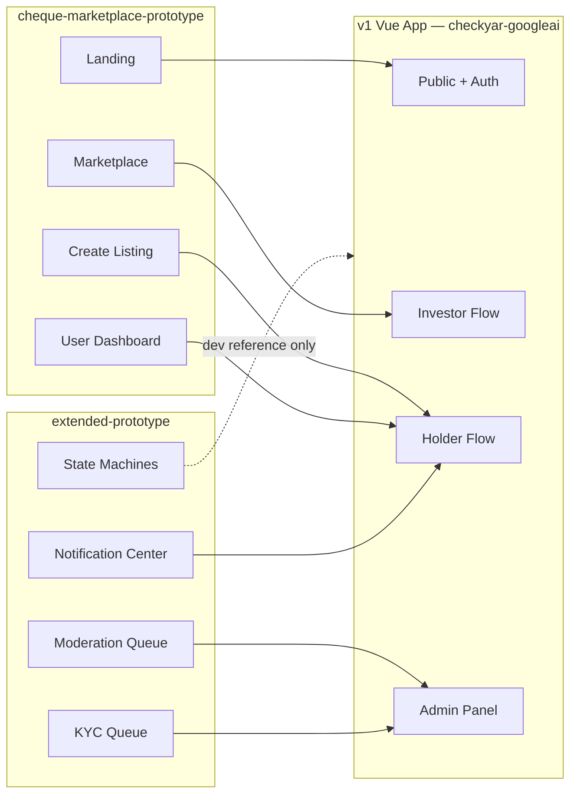
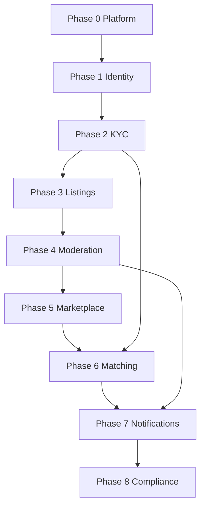

# برنامه اجرایی فازبندی — ساخت v1 لایه ۱ چک‌یار

**نقش این فایل:** سابقهٔ ساخت فازهای ۰–۸ است، نه برنامهٔ جاری «در حال ساخت MVP» و نه سند لانچ.

**وضعیت محصول (۱۴۰۵/۰۵/۲۳ / 2026-08-14):** **v1 لایه ۱ آماده پایلوت** — نه در حال ساخت MVP، نه v1 لانچ‌شده. فازهای ۰–۸ در بک‌اند `backend/doion/` انجام شده‌اند. مسیرهای `frontend/src/...` در بخش‌های زیر **تاریخی**اند (UI آرشیو). UI فعال: [checkyar-googleai](https://github.com/alamalhoda/checkyar-googleai). SSOT محصول: [`سند پایه پروژه (Core Brief).md`](../سند%20پایه%20پروژه%20(Core%20Brief).md). سیاست UI: [`development/FRONTEND_DEVELOPMENT_STATUS.md`](../development/FRONTEND_DEVELOPMENT_STATUS.md).

**گام بعدی (خارج از این فازبندی):** پایلوت کنترل‌شده، پروندهٔ حقوقی/رگولاتوری، hardening استقرار — نه فاز ۹ ساخت محصول، نه اعلام عرضه عمومی.

## وضعیت فعلی (Baseline)

| لایه | وضعیت | مرجع |
|------|--------|------|
| Backend | `doion.users` + JWT + identity/KYC + checks + pricing stub + moderation + marketplace + matching + notifications + compliance + integrations | [`backend/doion/`](../../backend/doion/) |
| Frontend فعال | Vue 3 + Naive UI + Pinia + Bun؛ توسعه در AI Studio | ریپوی خارجی `checkyar-googleai` |
| قرارداد API | SSOT واحد | [`docs/development/MASTER_API_CONTRACT.md`](../development/MASTER_API_CONTRACT.md) |
| مستندات معماری | LLD + معماری فنی هم‌تراز با کد ۱۴۰۵/۰۵ | [`cheque-platform-low-level-design.md`](../cheque-platform-low-level-design.md) |
| وضعیت محصول | v1 لایه ۱ آماده پایلوت | [`سند پایه پروژه (Core Brief).md`](../سند%20پایه%20پروژه%20(Core%20Brief).md) |

**نقشه پروتوتایپ → v1 (آماده پایلوت، نه لانچ‌شده):**

> **تصمیم ساختاری (انجام‌شده):** LLD ساختار `backend/apps/` را پیشنهاد می‌داد؛ appهای دامنه زیر `backend/doion/<app>/` ساخته شدند. مهاجرت فیزیکی به `apps/` در برنامهٔ جاری v1 نیست. بخش‌های فاز ۰–۸ زیر **سابقهٔ ساخت** هستند؛ کار جدید باید روی پایلوت/hardening باشد، نه تکرار این فازها.

---

## فاز ۰ — پلتفرم پایه (انجام‌شده)

**هدف:** زیرساخت مشترک backend و frontend آماده vertical sliceها باشد.

### Backend (تکمیل)
- JWT login با phone/username/email (موجود)
- افزودن `POST /api/v1/auth/refresh/` و versioning زیر `/api/v1/`
- Exception handler یکنواخت خطا (فرمت LLD بخش ۹)
- ثبت قرارداد API در [`docs/development/MASTER_API_CONTRACT.md`](docs/development/MASTER_API_CONTRACT.md)

### Frontend (تکمیل)
- اتصال `authStore` به API واقعی (موجود جدئی)
- ثبت routeهای تعریف‌شده ولی ناقص: `REGISTER`, `ADMIN_MODERATION_QUEUE`, `USER_MATCHES/:id`, `LANDING`
- تکمیل navigation در [`UserLayout`](frontend/src/layouts/) و [`AdminLayout`](frontend/src/layouts/)
- رفع باگ export در [`listingStore.ts`](frontend/src/features/listings/stores/listingStore.ts) (`fetchMarketplaceListings`)
- **Architecture Alignment:**
  - ایجاد `frontend/src/composables/` با `useToast.ts`, `useFileUpload.ts`, `useModal.ts`, `useFormat.ts`
  - ایجاد `frontend/src/components/ui/` برای atoms (Button, Input, Badge, Pill, Icon)
  - ایجاد `frontend/src/components/layout/` برای organisms (Nav, Footer, PageHeader)
  - پایه‌سازی i18n (fa) + RTL در main.ts (همراسی با design system)
  - sync کامل CSS variables با `cheque-marketplace-design-system.md`

### معیار پذیرش فاز ۰
- Login/logout/refresh پایدار
- Route guards بر اساس auth
- Build + lint بدون خطا

---

## فاز ۱ — Identity، نقش‌ها و Landing عمومی (انجام‌شده)

**پروتوتایپ:** Hero، stats bar، «چطور کار می‌کند»، footer — [`cheque-marketplace-prototype.html`](ai-preview/cheque-marketplace-prototype.html) (صفحه landing)

**جریان کسب‌وکار:** ثبت‌نام → انتخاب نقش (CheckHolder / Investor) → پروفایل اولیه

### Backend
| App | کار |
|-----|-----|
| `doion.core` | Base models (UUID, timestamps)، permission classes (`IsCheckHolder`, `IsInvestor`, `IsModerator`) |
| `doion.identity` | مدل‌های `Profile`, گسترش `User.role` + Django Groups |

**APIها:**
- `POST /api/v1/auth/register/` — موبایل + نقش
- `GET/PATCH /api/v1/users/me/` — پروفایل
- Groups: `CheckHolder`, `Investor`, `Moderator`, `Admin`

**State machine:** `REGISTERED` (از [`mvp-spec.md`](ai-preview/mvp-spec.md) §1.1)

### Frontend
| Feature | کار |
|---------|-----|
| `auth` | [`RegisterView.vue`](frontend/src/features/auth/views/RegisterView.vue) — انتخاب نقش + OTP stub |
| `landing` (جدید) | صفحه عمومی `/` — HeroSection, StatsBar, StepCard, FooterDisclaimer (atoms/molecules) |
| `dashboard` | داشبورد placeholder با badge نقش کاربر |

**Atomic Design Implementation:**
- `components/ui/Button.vue` (variant: primary, secondary, ghost)
- `components/ui/Icon.vue` (stub، extendable)
- `components/ui/Badge.vue` → RiskBadge, StatusPill
- `components/layout/HeroSection.vue`
- `components/layout/StatsBar.vue`
- `components/layout/StepCard.vue`
- `composables/useFormat.ts` → formatCurrency, formatPersianNumber

### تست فاز ۱
- ثبت‌نام دارنده چک و سرمایه‌گذار جدا
- Redirect نقش‌محور پس از login
- Landing بدون auth قابل مشاهده

---

## فاز ۲ — KYC و احراز هویت

**پروتوتایپ:** تب KYC در داشبورد + صف KYC ادمین — [`extended-prototype.html`](ai-preview/extended-prototype.html) (page-kyc)

**جریان:** `REGISTERED` → آپلود مدارک → `KYC_PENDING` → moderator approve/reject → `KYC_APPROVED`

### Backend
| App | کار |
|-----|-----|
| `doion.identity` | مدل `Verification` + state machine |
| `doion.documents` | سرویس مشترک `Document` (owner, related_object, document_type) — ذخیره فایل local/S3 adapter |

**APIها:**
- `POST /api/v1/verifications/` — شروع KYC + آپلود
- `GET /api/v1/verifications/me/` — وضعیت
- `GET /api/v1/moderation/kyc/` — صف KYC (Moderator)
- `POST /api/v1/moderation/kyc/{id}/decision/` — approve/reject با دلیل

**Events:** `VerificationSubmitted`, `VerificationApproved` → audit stub

**Policy enforcement:** طبق جدول دسترسی mvp-spec — بدون `KYC_APPROVED` ثبت آگهی/ابراز تمایل ممنوع

### Frontend
| Feature | کار |
|---------|-----|
| `verification` (جدید) | ویزارد KYC: `KycStep1.vue` (form), `KycStep2.vue` (upload), `KycStatusBadge.vue` (molecules) |
| `admin` | [`ModerationQueueView`](frontend/src/features/admin/views/ModerationQueueView.vue) الگو → `KycQueueView.vue` با responsive table |
| `components/ui/UploadArea.vue` (molecule) برای document uploads |
| `composables/useFileUpload.ts` → multipart upload + progress states |
| Guards | middleware KYC: redirect به verification اگر `REGISTERED`/`KYC_REJECTED` |

### تست فاز ۲
- کاربر KYC_PENDING نمی‌تواند listing بسازد
- Moderator approve → status badge «KYC تأییدشده» در داشبورد
- Reject با دلیل → امکان resubmit

---

## فاز ۳ — ثبت آگهی چک (Check Registry)

**پروتوتایپ:** فرم ۳ مرحله‌ای create listing — [`cheque-marketplace-prototype.html`](ai-preview/cheque-marketplace-prototype.html) (page-create)

**جریان:** ایجاد → `pending_moderation` → (moderation) → `published` / `rejected`

### Backend
| App | کار |
|-----|-----|
| `doion.checks` | `ChequeListing`, `IssuerProfile`, `TextChoices` status |
| `doion.pricing` | موتور stub: `suggested_discount_rate`, `risk_tier` از face_amount/due_date/issuer |
| `doion.documents` | `POST /api/v1/listings/{id}/documents/` |

**قواعد migration:**
- `unique_together (issuer_id, bank_name, cheque_serial_number)` — LLD §3
- Validation: `due_date` آینده، `face_amount > 0`

**APIها:**
- `POST /api/v1/listings/` — ایجاد (status=`pending_moderation`)
- `PATCH /api/v1/listings/{id}/` — ویرایش قبل از publish
- `GET /api/v1/listings/` — آگهی‌های مالک

**Events:** `ListingSubmittedForModeration`

### Frontend
| Feature | کار |
|---------|-----|
| `listings` | اتصال [`CreateListingView.vue`](frontend/src/features/listings/views/CreateListingView.vue) به API — Stepper ۳ مرحله (atoms-based) |
| | [`ListingsListView.vue`](frontend/src/features/listings/views/ListingsListView.vue) — لیست آگهی‌های من (DataTable organism) |
| | [`ListingDetailView.vue`](frontend/src/features/listings/views/ListingDetailView.vue) — جزئیات + وضعیت (modal integration) |
| | `ListingCard.vue` (organism) → از atoms ساخته شود |
| | `ReviewSummary.vue` (molecule) در step ۳ |
| | `components/ui/UploadArea.vue` + `composables/useFileUpload.ts` |
| | `composables/useFormat.ts` برای نمایش مبلغ/اعداد فارسی |

### تست فاز ۳
- ثبت آگهی کامل با مدارک → status «در انتظار بررسی»
- duplicate serial → خطای `VALIDATION_ERROR`
- نمایش نرخ تنزیل پیشنهادی در step 3

---

## فاز ۴ — Moderation و انتشار آگهی

**پروتوتایپ:** صف moderation + modal تأیید/رد — [`extended-prototype.html`](ai-preview/extended-prototype.html) (page-admin)

**جریان:** `pending_moderation` → approve → `published` / reject → `rejected` → resubmit (max 3)

### Backend
| App | کار |
|-----|-----|
| `doion.moderation` | `ModerationDecision`, queue service |
| Django Admin | fallback برای ops (LLD §1) |

**APIها:**
- `GET /api/v1/moderation/queue/` — فیلتر، sort، pagination
- `POST /api/v1/moderation/{id}/decision/` — `{decision, rejection_code?, rejection_note?}`

**Events:** `ChequeListingPublished`, `ListingRejected` → notification stub

### Frontend
| Feature | کار |
|---------|-----|
| `admin` | wire [`ModerationQueueView.vue`](frontend/src/features/admin/views/ModerationQueueView.vue) + route `ADMIN_MODERATION_QUEUE` |
| | Modal جزئیات: IssuerInfo, DocumentPreview, RejectionForm (organisms) |
| | `ConfirmationModal.vue` (organism) برای تصمیم approve/reject |
| `listings` | وضعیت rejected + CTA «اصلاح و ارسال مجدد» (useApi composable) |
| `dashboard` | stat «در انتظار بررسی» / «منتشرشده» (StatBadge atoms) |
| `composables/useApi.ts` → centralized error handling + retry logic |

### تست فاز ۴
- Moderator approve → listing در DB با status `published`
- Holder می‌بیند «منتشر شد» (notification در فاز ۷)
- Reject با دلیل → resubmit تا ۳ بار

---

![آماده]

## فاز ۵ — Marketplace و مرور سرمایه‌گذار (تکمیل)

**پروتوتایپ:** فیلتر sidebar، grid کارت‌ها، modal جزئیات — [`cheque-marketplace-prototype.html`](ai-preview/cheque-marketplace-prototype.html) (page-marketplace)

**جریان:** Investor (KYC_APPROVED) → browse → filter/sort → detail modal → ابراز تمایل

### Backend
| App | کار |
|-----|-----|
| `doion.marketplace` | `MarketplaceViewSet` فیلتر فقط `status=published` + `django-filter` |
| `doion.marketplace` | `latest_listings` action با `AllowAny` برای landing page |

**API:**
- `GET /api/v1/marketplace/listings/?risk_tier=&min_amount=&max_amount=&max_days_to_due=&issuer_type=&bank_name=&ordering=`
- `GET /api/v1/marketplace/listings/latest/` — ۴ listing آخر (public، بدون auth)

**فیلترها:** risk tier (`low/medium/high`), issuer type (`legal/natural`), amount range (`min_amount`, `max_amount`), days to due (`max_days_to_due`), bank name (`icontains`), ordering.

**Serializerها:** `MarketplaceSerializer` با `days_to_due`, `interest_count` (=0 placeholder). `MarketplaceLatestSerializer` برای داده‌های عمومی.

**Pagination:** Emulated via override params (`page`, `page_size`, max=50).

**Cache:** Headers TTL 60s on list.

**تست:** 36 tests marketplace + moderation + identity — همه سبز.

### Frontend
| Feature | کار |
|---------|-----|
| `marketplace` | [`MarketplaceView.vue`](frontend/src/features/marketplace/views/MarketplaceView.vue) — browse + filters + pagination |
| | [`MarketplaceListingCard.vue`](frontend/src/features/marketplace/components/MarketplaceListingCard.vue) — کارت listing با تاریخ فارسی |
| | [`FilterSidebar.vue`](frontend/src/features/marketplace/components/FilterSidebar.vue) — فیلترهای risk tier، مبلغ، روز سررسید، نوع صادرکننده، بانک |
| | [`ListingDetailModal.vue`](frontend/src/features/marketplace/components/ListingDetailModal.vue) — modal جزئیات + دکمه «ابراز تمایل» متصل به API |
| | KYC gate: investor بدون `is_verified` بنر CTA می‌بیند، چک‌هاورد بنر «فقط برای سرمایه‌گذاران» |
| `landing` | بخش «آخرین آگهی‌ها» — fetch ۴ listing منتشرشده از endpoint عمومی + CTA برای کاربران غیراحرازشده |

### تست فاز ۵
- فقط `published` listings نمایش داده شوند
- فیلتر risk + sort کار کند
- Investor بدون KYC → CTA «تکمیل احراز هویت»
- Landing page عمومی بدون auth ۴ listing آخر را نشان می‌دهد
- Express interest → match created → navigate to matches

---

## فاز ۶ — Matching و Settlement (لایه ۱) (تکمیل)

**پروتوتایپ:** دکمه «ابراز تمایل»، تب‌های investor/holder در dashboard، match rows — [`cheque-marketplace-prototype.html`](ai-preview/cheque-marketplace-prototype.html) (dashboard tabs)

**جریان:** Investor express interest → `Match(pending)` → Holder accept/decline → `accepted` → both confirm off-platform → `settled`

### Backend
| App | کار |
|-----|-----|
| `doion.matching` | `Match` model + state machine (mvp-spec §1.3) |
| `doion.core` | `SettlementPort` + `OffPlatformSettlement` (LLD §7) |

**APIها:**
- `POST /api/v1/matches/` — investor creates match
- `PATCH /api/v1/matches/{id}/accept/` — holder accepts
- `PATCH /api/v1/matches/{id}/decline/` — holder declines
- `PATCH /api/v1/matches/{id}/cancel/` — investor cancels
- `PATCH /api/v1/matches/{id}/confirm-off-platform/` — holder confirms settlement
- `GET /api/v1/matches/` — filtered by role

**Events:** `MatchCreated`, `MatchAccepted`, `MatchDeclined`, `SettlementConfirmed`

**Side-effect:** listing → `MATCHED` when match accepted

### Frontend
| Feature | کار |
|---------|-----|
| `marketplace` | دکمه «ابراز تمایل» در [`ListingDetailModal.vue`](frontend/src/features/marketplace/components/ListingDetailModal.vue) → API + toast + navigate to matches |
| `matches` | [`MatchesListView.vue`](frontend/src/features/matches/views/MatchesListView.vue) — تب‌های pending/accepted/completed |
| | [`MatchDetailView.vue`](frontend/src/features/matches/views/MatchDetailView.vue) — جزئیات + action buttons (accept/decline/confirm/cancel) |
| | [`MatchCard.vue`](frontend/src/features/matches/components/MatchCard.vue) — کارت تطابق با عنوان bank + مبلغ، status badge، تاریخ فارسی |
| `services` | [`matchService.ts`](frontend/src/features/matches/services/matchService.ts) — متصل به API واقعی با mapping درست serializer fields |
| `types` | [`match.ts`](frontend/src/features/matches/types/match.ts) — `MatchStatus` هماهنگ با backend constants |
| `i18n` | کلیدهای `matches.*` در fa.json + en.json اضافه شد |

### تست فاز ۶
- Investor express interest → match created → notification (in-app)
- Holder accept → listing status `matched`
- Both confirm off-platform → audit record, disclaimer نمایش داده شود
- Match detail view: action buttons فقط برای نقش کاربر صحیح نمایش داده می‌شوند

---

## فاز ۷ — Notifications و Activity Feed ✅

**پروتوتایپ:** مرکز اعلان‌ها + تنظیمات کانال — [`extended-prototype.html`](ai-preview/extended-prototype.html) (page-notif)

### Backend
| App | کار |
|-----|-----|
| `doion.notifications` | مدل `Notification` + `NotificationPreference`، ViewSet با list/retrieve/mark-all-read/preferences |
| `doion.integrations` | SMS stub model + سرویس `send_sms` |
| Celery | task `expire_listings` (هر ۶۰ دقیقه) |

**APIها:**
- `GET /api/v1/notifications/` — paginated, فیلتر بر اساس `type` و `is_read`
- `PATCH /api/v1/notifications/{id}/` — علامت‌گذاری read
- `POST /api/v1/notifications/mark-all-read/` — علامت‌گذاری همه به‌عنوان read
- `GET/PATCH /api/v1/notifications/preferences/` — تنظیمات کاربر

**Event subscribers:** 
- `ChequeListingPublished` → نوتیفیکیشن برای holder
- `ListingRejected` → نوتیفیکیشن برای holder
- توابع کمکی برای Match events (MatchCreated, MatchAccepted, MatchDeclined, MatchCancelled, SettlementConfirmed)

### Frontend
| Feature | کار |
|---------|-----|
| `notifications` | `NotificationsView.vue` — تب‌بندی: همه/تطابق/آگهی/KYC/تنظیمات |
| | `NotificationItem.vue` (organism) با آیکون‌های مناسب |
| | `NotificationSidebar.vue` (organism) با فیلترها و unread badge |
| Layout | در `Nav.vue` — ستون اعلان + badge شمارش unread |
| `composables/usePolling.ts` → polling خودکار هر ۳۰ ثانیه |

### تست فاز ۷
- Model creation و indexes ✅
- API endpoints (list/filter/mark-read/mark-all-read/preferences) ✅
- Signal handlers برای listing events ✅
- SMS stub service ✅
- Celery task برای expire_listings ✅
- Frontend view + store + service ✅
- Empty state و unread styling ✅

---

## فاز ۸ — Compliance، Jobs و Hardening (تکمیل)

**پروتوتایپ:** stats admin، state machine viz (فقط dev/internal)

### Backend
| App | کار |
|-----|-----|
| `doion.compliance` | `AuditEvent`, `FeatureFlag` |
| `doion.compliance` | `is_verified` روی `Profile` توسط signal handlers به‌روز می‌شود |
| Celery Beat | job انقضای listing (`due_date_passed` → `EXPIRED`) |
| Infrastructure | rate limiting (LLD §10), structlog + correlation_id |

**APIها:**
- `GET/PATCH /api/v1/feature-flags/{key}/` — Admin
- `GET /api/v1/compliance/stats/` — aggregate admin stats
- `GET /api/v1/compliance/audit/` — paginated audit events
- Audit خودکار روی transitions حساس
- `UserSerializer` حالا `is_verified` را از `profile` برمی‌گرداند

### Frontend
| Feature | کار |
|---------|-----|
| `admin` | [`AdminDashboardView.vue`](frontend/src/features/admin/views/AdminDashboardView.vue) — stats واقعی از API (StatCard organisms) |
| | [`FeatureFlagsView.vue`](frontend/src/features/admin/views/FeatureFlagsView.vue) — UI مدیریت feature flags |
| Error UX | کاتالوگ خطاهای [`mvp-spec.md`](ai-preview/mvp-spec.md) §2 — AUTH_*, LISTING_*, MATCH_* همراه error boundary components |
| Polish | responsive (768px breakpoints پروتوتایپ)، loading/empty states (Skeleton organisms) |
| `components/ui/ErrorBoundary.vue` (organism) برای error states |
| `composables/useErrorHandler.ts` → global error handling + user feedback |

### تست فاز ۸
- Listing گذشته از due_date → auto EXPIRED
- Feature flag `matching_enabled=false` → دکمه express interest غیرفعال
- E2E smoke: register → KYC → create listing → moderate → browse → match → notify
- Backend tests: 105 tests سبز (identity, compliance, marketplace, matching)

---

## وابستگی فازها

---

## قراردادهای توسعه (تاریخی — برای فازهای ۰–۸)

این قراردادها هنگام **ساخت** v1 اعمال می‌شدند. کار جدید: GitFlow از `develop` با `feature/*` (نه لزوماً `feature/phase-N-*`)، قرارداد API در [`MASTER_API_CONTRACT.md`](../development/MASTER_API_CONTRACT.md)، UI فقط از طریق AI Studio → `checkyar-googleai`.

### Git Flow
مرجع: [`.cursor/rules/share/gitflow-branch-policy.mdc`](../../.cursor/rules/share/gitflow-branch-policy.mdc)
- هنگام ساخت فازها از `feature/phase-N-*` از `develop` استفاده می‌شد
- کار جدید (پایلوت/hardening) با `feature/*` از `develop`؛ ادغام فقط از طریق PR
- commit format: `feat(scope): description`
- قبل از PR: همگام‌سازی با `origin/develop` و تست‌های موفق

### مستندسازی هر PR
- به‌روز [`docs/development/MASTER_API_CONTRACT.md`](docs/development/MASTER_API_CONTRACT.md)
- به‌روز [`docs/development/PAGE_REVIEW_LOG.md`](docs/development/PAGE_REVIEW_LOG.md)
- [`backend/TODO.md`](../../backend/TODO.md)؛ UI فعال TODO جدا در مونورپو ندارد

### Definition of Done (هر فاز)
1. Backend: migrations + serializer tests + permission tests
2. Frontend: اتصال API (نه mock) + error states
3. Frontend Architecture: component hierarchy follows Atomic Design، composables جدا، service layer
4. Frontend Tests: واحدهای جدید ≥70% coverage (بر اساس [`frontend-testing-strategy/WORKFLOW.md`](.kilo/workflows/frontend-testing-strategy/WORKFLOW.md))
5. Manual test checklist در PR body
6. OpenAPI schema به‌روز (`drf-spectacular`)

---

## تخمین نسبی (تاریخی — هنگام ساخت)

| فاز | مدت تقریبی | خروجی قابل دمو |
|-----|------------|----------------|
| ۰ (تکمیل) | ۳–۵ روز | Auth پایدار |
| ۱ | ۱ هفته | Landing + Register |
| ۲ | ۱.۵ هفته | KYC end-to-end |
| ۳ | ۱.۵ هفته | Create listing |
| ۴ | ۱ هفته | Moderation |
| ۵ | ۱ هفته | Marketplace browse |
| ۶ | ۱.۵ هفته | Matching |
| ۷ | ۱ هفته | Notifications |
| ۸ | ۱ هفته | **v1 لایه ۱ آماده پایلوت** — نه لانچ‌شده |
| **جمع** | **~۱۰–۱۱ هفته** | ساخت v1 لایه ۱ (تکمیل) |

---

## موارد خارج از دامنه v1 لایه ۱ (YAGNI)

این موارد عمداً در ساخت v1 نیامده‌اند و پیش‌نیاز پایلوت نیستند:

- State machine visualization page (فقط مرجع dev تاریخی)
- Escrow / payment / in-platform messaging
- ارائه‌دهنده واقعی SMS/KYC (adapter stub کافی است)
- Analytics dashboard مستقل (از `AuditEvent` بعداً)
- monetization (کارمزد آگهی/اشتراک/match)
- عرضه عمومی / لانچ

کار جاری پس از این فایل: پایلوت، انطباق حقوقی، و hardening استقرار — مطابق Core Brief.
