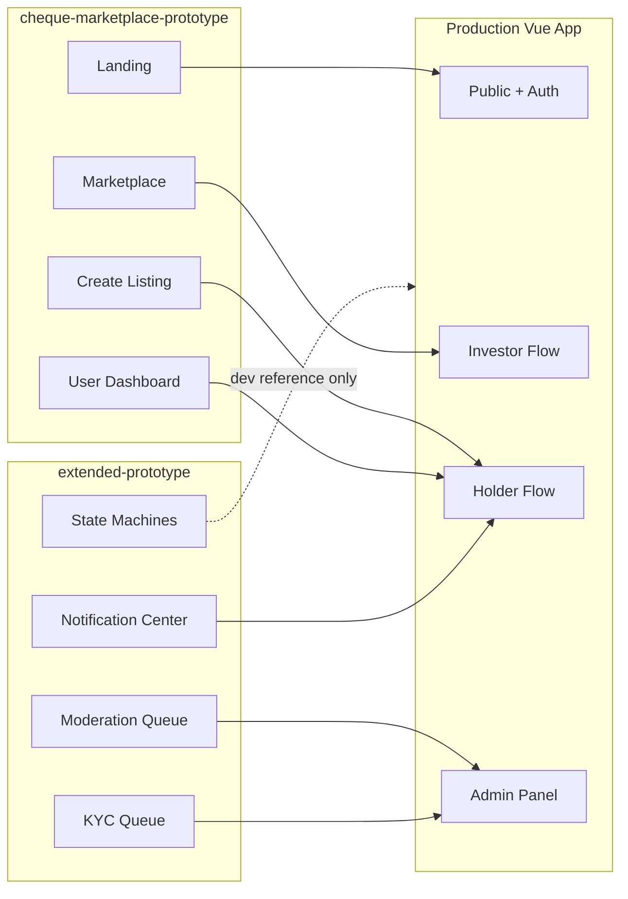
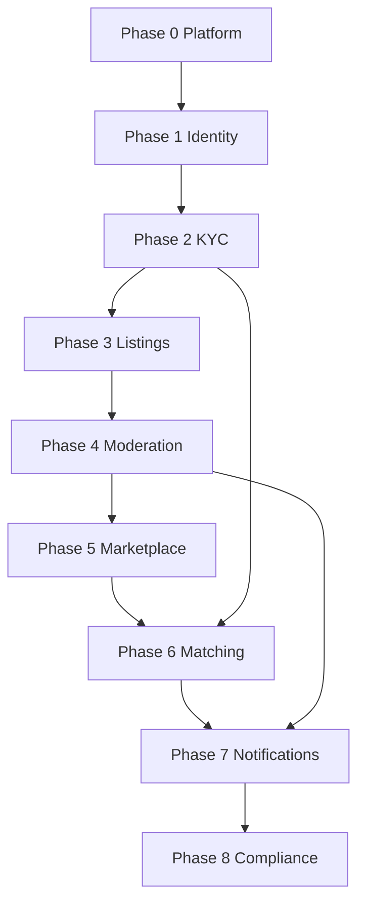

# برنامه اجرایی فازبندی — چک‌بازار MVP

## وضعیت فعلی (Baseline)

| لایه | وضعیت | مرجع |
|------|--------|------|
| Backend | `doion.users` + JWT login + `doion.core` + `doion.identity` + role field + register API + `doion.checks` + `doion.pricing` + `doion.moderation` + `doion.marketplace` | [`backend/doion/`](backend/doion/) |
| Frontend | Vue 3 + design tokens + UI shells + landing + register + role badge | [`frontend/src/features/`](frontend/src/features/) |
| مستندات | LLD، معماری، state machines، design system، API contract | [`docs/cheque-platform-low-level-design.md`](docs/cheque-platform-low-level-design.md)، [`ai-preview/mvp-spec.md`](ai-preview/mvp-spec.md)، [`docs/development/API_CONTRACT_REGISTRY.md`](docs/development/API_CONTRACT_REGISTRY.md) |

**نقشه پروتوتایپ → محصول:**

> **تصمیم ساختاری:** LLD ساختار `backend/apps/` را پیشنهاد می‌دهد؛ کد فعلی Cookiecutter با `backend/doion/` است. در فاز ۱، appهای دامنه را زیر `backend/doion/<app>/` بسازید (هم‌راستا با `users`) و نام‌گذاری bounded context را از LLD حفظ کنید. مهاجرت فیزیکی به `apps/` اختیاری و بعد از MVP است.

---

## فاز ۰ — پلتفرم پایه (انجام‌شده)

**هدف:** زیرساخت مشترک backend و frontend آماده vertical sliceها باشد.

### Backend (تکمیل)
- JWT login با phone/username/email (موجود)
- افزودن `POST /api/v1/auth/refresh/` و versioning زیر `/api/v1/`
- Exception handler یکنواخت خطا (فرمت LLD بخش ۹)
- ثبت قرارداد API در [`docs/development/API_CONTRACT_REGISTRY.md`](docs/development/API_CONTRACT_REGISTRY.md)

### Frontend (تکمیل)
- اتصال `authStore` به API واقعی (موجود جدئی)
- ثبت routeهای تعریف‌شده ولی ناقص: `REGISTER`, `ADMIN_MODERATION_QUEUE`, `USER_MATCHES/:id`, `LANDING`
- تکمیل navigation در [`UserLayout`](frontend/src/layouts/) و [`AdminLayout`](frontend/src/layouts/)
- رفع باگ export در [`listingStore.ts`](frontend/src/features/listings/stores/listingStore.ts) (`fetchMarketplaceListings`)
- **Architecture Alignment:**
  - ایجاد `frontend/src/composables/` با `useToast.ts`, `useFileUpload.ts`, `useModal.ts`, `useFormat.ts`
  - ایجاد `frontend/src/components/ui/` برای atoms (Button, Input, Badge, Pill, Icon)
  - ایجاد `frontend/src/components/layout/` برای organisms (Nav, Footer, PageHeader)
  - پایه‌سازی i18n (fa) + RTL در main.ts (همراسی با design system)
  - sync کامل CSS variables با `cheque-marketplace-design-system.md`

### معیار پذیرش فاز ۰
- Login/logout/refresh پایدار
- Route guards بر اساس auth
- Build + lint بدون خطا

---

## فاز ۱ — Identity، نقش‌ها و Landing عمومی (انجام‌شده)

**پروتوتایپ:** Hero، stats bar، «چطور کار می‌کند»، footer — [`cheque-marketplace-prototype.html`](ai-preview/cheque-marketplace-prototype.html) (صفحه landing)

**جریان کسب‌وکار:** ثبت‌نام → انتخاب نقش (CheckHolder / Investor) → پروفایل اولیه

### Backend
| App | کار |
|-----|-----|
| `doion.core` | Base models (UUID, timestamps)، permission classes (`IsCheckHolder`, `IsInvestor`, `IsModerator`) |
| `doion.identity` | مدل‌های `Profile`, گسترش `User.role` + Django Groups |

**APIها:**
- `POST /api/v1/auth/register/` — موبایل + نقش
- `GET/PATCH /api/v1/users/me/` — پروفایل
- Groups: `CheckHolder`, `Investor`, `Moderator`, `Admin`

**State machine:** `REGISTERED` (از [`mvp-spec.md`](ai-preview/mvp-spec.md) §1.1)

### Frontend
| Feature | کار |
|---------|-----|
| `auth` | [`RegisterView.vue`](frontend/src/features/auth/views/RegisterView.vue) — انتخاب نقش + OTP stub |
| `landing` (جدید) | صفحه عمومی `/` — HeroSection, StatsBar, StepCard, FooterDisclaimer (atoms/molecules) |
| `dashboard` | داشبورد placeholder با badge نقش کاربر |

**Atomic Design Implementation:**
- `components/ui/Button.vue` (variant: primary, secondary, ghost)
- `components/ui/Icon.vue` (stub، extendable)
- `components/ui/Badge.vue` → RiskBadge, StatusPill
- `components/layout/HeroSection.vue`
- `components/layout/StatsBar.vue`
- `components/layout/StepCard.vue`
- `composables/useFormat.ts` → formatCurrency, formatPersianNumber

### تست فاز ۱
- ثبت‌نام دارنده چک و سرمایه‌گذار جدا
- Redirect نقش‌محور پس از login
- Landing بدون auth قابل مشاهده

---

## فاز ۲ — KYC و احراز هویت

**پروتوتایپ:** تب KYC در داشبورد + صف KYC ادمین — [`extended-prototype.html`](ai-preview/extended-prototype.html) (page-kyc)

**جریان:** `REGISTERED` → آپلود مدارک → `KYC_PENDING` → moderator approve/reject → `KYC_APPROVED`

### Backend
| App | کار |
|-----|-----|
| `doion.identity` | مدل `Verification` + state machine |
| `doion.documents` | سرویس مشترک `Document` (owner, related_object, document_type) — ذخیره فایل local/S3 adapter |

**APIها:**
- `POST /api/v1/verifications/` — شروع KYC + آپلود
- `GET /api/v1/verifications/me/` — وضعیت
- `GET /api/v1/moderation/kyc/` — صف KYC (Moderator)
- `POST /api/v1/moderation/kyc/{id}/decision/` — approve/reject با دلیل

**Events:** `VerificationSubmitted`, `VerificationApproved` → audit stub

**Policy enforcement:** طبق جدول دسترسی mvp-spec — بدون `KYC_APPROVED` ثبت آگهی/ابراز تمایل ممنوع

### Frontend
| Feature | کار |
|---------|-----|
| `verification` (جدید) | ویزارد KYC: `KycStep1.vue` (form), `KycStep2.vue` (upload), `KycStatusBadge.vue` (molecules) |
| `admin` | [`ModerationQueueView`](frontend/src/features/admin/views/ModerationQueueView.vue) الگو → `KycQueueView.vue` با responsive table |
| `components/ui/UploadArea.vue` (molecule) برای document uploads |
| `composables/useFileUpload.ts` → multipart upload + progress states |
| Guards | middleware KYC: redirect به verification اگر `REGISTERED`/`KYC_REJECTED` |

### تست فاز ۲
- کاربر KYC_PENDING نمی‌تواند listing بسازد
- Moderator approve → status badge «KYC تأییدشده» در داشبورد
- Reject با دلیل → امکان resubmit

---

## فاز ۳ — ثبت آگهی چک (Check Registry)

**پروتوتایپ:** فرم ۳ مرحله‌ای create listing — [`cheque-marketplace-prototype.html`](ai-preview/cheque-marketplace-prototype.html) (page-create)

**جریان:** `DRAFT` → submit → `PENDING_MODERATION`

### Backend
| App | کار |
|-----|-----|
| `doion.checks` | `ChequeListing`, `IssuerProfile`, `TextChoices` status |
| `doion.pricing` | موتور stub: `suggested_discount_rate`, `risk_tier` از face_amount/due_date/issuer |
| `doion.documents` | `POST /api/v1/listings/{id}/documents/` |

**قواعد migration:**
- `unique_together (issuer_id, bank_name, cheque_serial_number)` — LLD §3
- Validation: `due_date` آینده، `face_amount > 0`

**APIها:**
- `POST /api/v1/listings/` — ایجاد (status=`pending_moderation`)
- `PATCH /api/v1/listings/{id}/` — ویرایش قبل از publish
- `GET /api/v1/listings/` — آگهی‌های مالک

**Events:** `ListingSubmittedForModeration`

### Frontend
| Feature | کار |
|---------|-----|
| `listings` | اتصال [`CreateListingView.vue`](frontend/src/features/listings/views/CreateListingView.vue) به API — Stepper ۳ مرحله (atoms-based) |
| | [`ListingsListView.vue`](frontend/src/features/listings/views/ListingsListView.vue) — لیست آگهی‌های من (DataTable organism) |
| | [`ListingDetailView.vue`](frontend/src/features/listings/views/ListingDetailView.vue) — جزئیات + وضعیت (modal integration) |
| | `ListingCard.vue` (organism) → از atoms ساخته شود |
| | `ReviewSummary.vue` (molecule) در step ۳ |
| | `components/ui/UploadArea.vue` + `composables/useFileUpload.ts` |
| | `composables/useFormat.ts` برای نمایش مبلغ/اعداد فارسی |

### تست فاز ۳
- ثبت آگهی کامل با مدارک → status «در انتظار بررسی»
- duplicate serial → خطای `VALIDATION_ERROR`
- نمایش نرخ تنزیل پیشنهادی در step 3

---

## فاز ۴ — Moderation و انتشار آگهی

**پروتوتایپ:** صف moderation + modal تأیید/رد — [`extended-prototype.html`](ai-preview/extended-prototype.html) (page-admin)

**جریان:** `PENDING_MODERATION` → approve → `PUBLISHED` / reject → `REJECTED` → resubmit (max 3)

### Backend
| App | کار |
|-----|-----|
| `doion.moderation` | `ModerationDecision`, queue service |
| Django Admin | fallback برای ops (LLD §1) |

**APIها:**
- `GET /api/v1/moderation/queue/` — فیلتر، sort، pagination
- `POST /api/v1/moderation/listings/{id}/decision/` — `{decision, rejection_reason?}`

**Events:** `ChequeListingPublished`, `ListingRejected` → notification stub

### Frontend
| Feature | کار |
|---------|-----|
| `admin` | wire [`ModerationQueueView.vue`](frontend/src/features/admin/views/ModerationQueueView.vue) + route `ADMIN_MODERATION_QUEUE` |
| | Modal جزئیات: IssuerInfo, DocumentPreview, RejectionForm (organisms) |
| | `ConfirmationModal.vue` (organism) برای تصمیم approve/reject |
| `listings` | وضعیت rejected + CTA «اصلاح و ارسال مجدد» (useApi composable) |
| `dashboard` | stat «در انتظار بررسی» / «منتشرشده» (StatBadge atoms) |
| `composables/useApi.ts` → centralized error handling + retry logic |

### تست فاز ۴
- Moderator approve → listing در DB با status `published`
- Holder می‌بیند «منتشر شد» (notification در فاز ۷)
- Reject با دلیل → resubmit تا ۳ بار

---

![آماده]

## فاز ۵ — Marketplace و مرور سرمایه‌گذار (Backend API ✅)

**پروتوتایپ:** فیلتر sidebar، grid کارت‌ها، modal جزئیات — [`cheque-marketplace-prototype.html`](ai-preview/cheque-marketplace-prototype.html) (page-marketplace)

**جریان:** Investor (KYC_APPROVED) → browse → filter/sort → detail modal

### Backend
| App | کار |
|-----|-----|
| `doion.marketplace` | `MarketplaceViewSet` فیلتر فقط `status=published` + `django-filter` |

**API:**
- `GET /api/v1/marketplace/listings/?risk_tier=&min_amount=&max_amount=&max_days_to_due=&issuer_type=&bank_name=&ordering=`

**فیلترها:** risk tier (`low/medium/high`), issuer type (`legal/natural`), amount range (`min_amount`, `max_amount`), days to due (`max_days_to_due`), bank name (`icontains`), ordering.

**Serializerها:** `MarketplaceSerializer` با `days_to_due`, `interest_count` (=0 placeholder).

**Pagination:** Emulated via override params (`page`, `page_size`, max=50).

**Cache:** Headers TTL 60s on list.

**تست:** 36 tests marketplace + moderation + identity — همه سبز.

### Frontend
| Feature | کار |
|---------|-----|
| `marketplace` | Wire [`MarketplaceView.vue`](frontend/src/features/marketplace/views/MarketplaceView.vue) + [`MarketplaceListingCard.vue`](frontend/src/features/marketplace/components/MarketplaceListingCard.vue) |
| | FilterSidebar organism (risk tier, days to due, min amount, issuer type, bank name) |
| | DetailModal organism (ListingDetail, RiskBar, DiscountRate) |
| | `useModal.ts` composable برای modal state management |
| `landing` | بخش «آخرین آگهی‌ها» — fetch ۴ listing منتشرشده (RealTimeCard atoms) |

### تست فاز ۵
- فقط `published` listings نمایش داده شوند
- فیلتر risk + sort کار کند
- Investor بدون KYC → CTA «تکمیل احراز هویت»

---

## فاز ۶ — Matching و Settlement (لایه ۱)

**پروتوتایپ:** دکمه «ابراز تمایل»، تب‌های investor/holder در dashboard، match rows — [`cheque-marketplace-prototype.html`](ai-preview/cheque-marketplace-prototype.html) (dashboard tabs)

**جریان:** Investor express interest → `Match(PENDING)` → Holder accept/decline → `ACCEPTED` → both confirm off-platform → `SETTLED`

### Backend
| App | کار |
|-----|-----|
| `doion.matching` | `Match` model + state machine (mvp-spec §1.3) |
| `doion.core` | `SettlementPort` + `OffPlatformSettlement` (LLD §7) |

**APIها:**
- `POST /api/v1/matches/` — investor creates match
- `PATCH /api/v1/matches/{id}/status/` — transitions: accept, decline, confirm, cancel
- `GET /api/v1/matches/` — filtered by role

**Events:** `MatchCreated`, `MatchAccepted`, `MatchDeclined`, `SettlementConfirmed`

**Side-effect:** listing → `MATCHED` when match accepted

### Frontend
| Feature | کار |
|---------|-----|
| `marketplace` | دکمه «ابراز تمایل» → API + ConfirmationDialog organism |
| `matches` | wire [`MatchesListView.vue`](frontend/src/features/matches/views/MatchesListView.vue) + MatchDetail organism |
| `components/ui/MatchCard.vue` (molecule) برای match rows |
| `components/ui/ConfirmationDialog.vue` (molecule) برای action confirm |
| `dashboard` | تب‌های holder/investor با stats واقعی |
| | Holder: accept/decline incoming matches (MatchAction organism) |

### تست فاز ۶
- Investor express interest → holder notification (in-app)
- Holder accept → listing status `matched`
- Both confirm off-platform → audit record, disclaimer نمایش داده شود

---

## فاز ۷ — Notifications و Activity Feed

**پروتوتایپ:** مرکز اعلان‌ها + تنظیمات کانال — [`extended-prototype.html`](ai-preview/extended-prototype.html) (page-notif)

### Backend
| App | کار |
|-----|-----|
| `doion.matching` | مدل `Notification` |
| `doion.integrations` | SMS adapter stub (Celery async) |
| Celery | worker + task `send_notification` |

**APIها:**
- `GET /api/v1/notifications/` — paginated, filter by type
- `PATCH /api/v1/notifications/{id}/read/`
- `POST /api/v1/notifications/mark-all-read/`
- `GET/PATCH /api/v1/notifications/preferences/`

**Event subscribers:** MatchCreated, ChequeListingPublished, VerificationApproved, ListingRejected

### Frontend
| Feature | کار |
|---------|-----|
| `notifications` | wire [`NotificationsView.vue`](frontend/src/features/notifications/views/NotificationsView.vue) — tabs: all/match/kyc/listing/settings |
| | `NotificationItem.vue` (organism) از atoms |
| | `NotificationSidebar.vue` (organism) برای filter tabs |
| Layout | bell badge + unread count در nav (useApi polling) |
| `composables/usePolling.ts` → polling برای unread count |
| `dashboard` | تب activity — timeline از notifications (Timeline organism) |

### تست فاز ۷
- MatchCreated → in-app notification برای holder
- Mark all read → badge صفر
- Preferences toggle (persist در backend)

---

## فاز ۸ — Compliance، Jobs و Hardening

**پروتوتایپ:** stats admin، state machine viz (فقط dev/internal)

### Backend
| App | کار |
|-----|-----|
| `doion.compliance` | `AuditEvent`, `FeatureFlag` |
| Celery Beat | job انقضای listing (`due_date_passed` → `EXPIRED`) |
| Infrastructure | rate limiting (LLD §10), structlog + correlation_id |

**APIها:**
- `GET/PATCH /api/v1/feature-flags/{key}/` — Admin
- Audit خودکار روی transitions حساس

### Frontend
| Feature | کار |
|---------|-----|
| `admin` | [`AdminDashboardView.vue`](frontend/src/features/admin/views/AdminDashboardView.vue) — stats واقعی از API (StatCard organisms) |
| Error UX | کاتالوگ خطاهای [`mvp-spec.md`](ai-preview/mvp-spec.md) §2 — AUTH_*, LISTING_*, MATCH_* همراه error boundary components |
| Polish | responsive (768px breakpoints پروتوتایپ)، loading/empty states (Skeleton organisms) |
| `components/ui/ErrorBoundary.vue` (organism) برای error states |
| `composables/useErrorHandler.ts` → global error handling + user feedback |

### تست فاز ۸
- Listing گذشته از due_date → auto EXPIRED
- Feature flag `matching_enabled=false` → دکمه express interest غیرفعال
- E2E smoke: register → KYC → create listing → moderate → browse → match → notify

---

## وابستگی فازها

---

## قراردادهای توسعه (هر فاز)

### Git Flow — الزام بر Rسوپراپ
تمام توسعه‌ی این برنامه **الزاماً** باید طبق [`shared-gitflow-branch-policy/WORKFLOW.md`](.kilo/workflows/shared-gitflow-branch-policy/WORKFLOW.md) انجام شود:
- ✅ **فقط** از `feature/phase-N-*` برای شروع کار جدید استفاده شود
- ✅ branch جدید از `develop` شا�ف می‌شود: `git checkout -b feature/phase-0-platform-setup develop`
- ✅ هر ادغام به `develop` فقط از طریق Pull Request
- ✅ commit format: `feat(scope): description` (conventional commits)
- ✅ قبل از PR: rebase/merge با `origin/develop` و تست‌های موفق
- ✅ چک‌لیست قبل از PR رعایت شود (build، تست، conflict رفع شده)

### مستندسازی هر PR
- به‌روز [`docs/development/API_CONTRACT_REGISTRY.md`](docs/development/API_CONTRACT_REGISTRY.md)
- به‌روز [`docs/development/PAGE_REVIEW_LOG.md`](docs/development/PAGE_REVIEW_LOG.md)
- [`backend/TODO.md`](backend/TODO.md) / [`frontend/TODO.md`](frontend/TODO.md)

### Definition of Done (هر فاز)
1. Backend: migrations + serializer tests + permission tests
2. Frontend: اتصال API (نه mock) + error states
3. Frontend Architecture: component hierarchy follows Atomic Design، composables جدا، service layer
4. Frontend Tests: واحدهای جدید ≥70% coverage (بر اساس [`frontend-testing-strategy/WORKFLOW.md`](.kilo/workflows/frontend-testing-strategy/WORKFLOW.md))
5. Manual test checklist در PR body
6. OpenAPI schema به‌روز (`drf-spectacular`)

---

## تخمین نسبی (تیم ۲ نفر: ۱ BE + ۱ FE)

| فاز | مدت تقریبی | خروجی قابل دمو |
|-----|------------|----------------|
| ۰ (تکمیل) | ۳–۵ روز | Auth پایدار |
| ۱ | ۱ هفته | Landing + Register |
| ۲ | ۱.۵ هفته | KYC end-to-end |
| ۳ | ۱.۵ هفته | Create listing |
| ۴ | ۱ هفته | Moderation |
| ۵ | ۱ هفته | Marketplace browse |
| ۶ | ۱.۵ هفته | Matching |
| ۷ | ۱ هفته | Notifications |
| ۸ | ۱ هفته | Production-ready MVP |
| **جمع** | **~۱۰–۱۱ هفته** | |

---

## موارد خارج از scope MVP (YAGNI)

- State machine visualization page (فقط مرجع dev در [`WorkflowPrototypeView`](frontend/src/features/workflow/views/WorkflowPrototypeView.vue))
- Escrow / payment / in-platform messaging
- Real SMS/KYC provider (adapter stub کافی است)
- Analytics dashboard (از AuditEvent بعداً)
