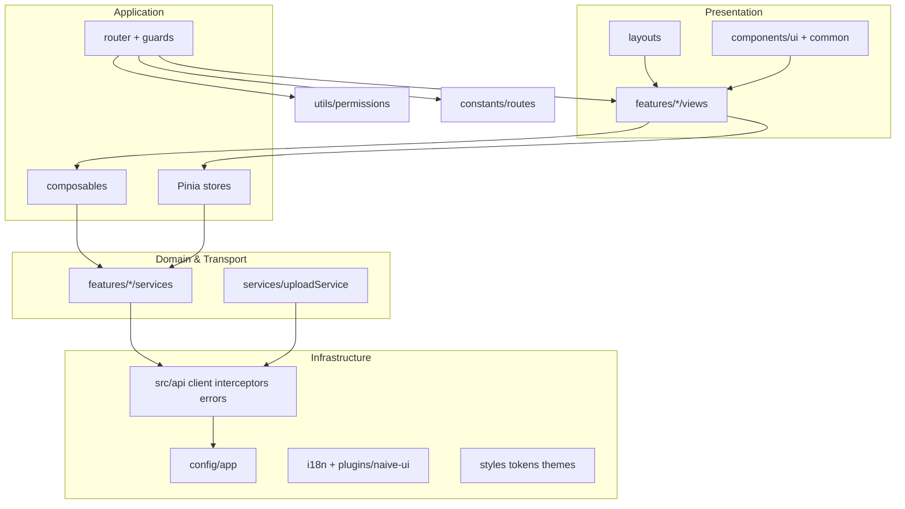
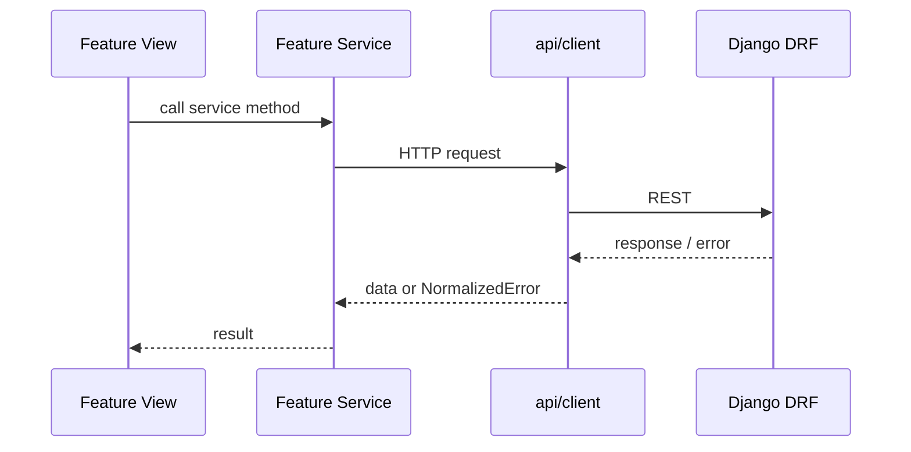

# معماری Frontend — doion (legacy archive)

> **آرشیو:** این درخت قبلاً `frontend/` بود و از ۲۰۲۶-۰۷-۳۱ به `frontend-legacy/` منتقل شده است. UI فعال در [checkyar-googleai](https://github.com/alamalhoda/checkyar-googleai) است — جزئیات: [`docs/development/FRONTEND_DEVELOPMENT_STATUS.md`](../docs/development/FRONTEND_DEVELOPMENT_STATUS.md).  
> **وضعیت:** این سند مرجع معماری **بالادستی** برای پوشه **آرشیو** `frontend-legacy/` است.  
> **پیاده‌سازی اولیه:** طبق [`phase 0 prompt.md`](./phase%200%20prompt.md) (فاز ۰ — platform scaffold).  
> **قوانین Cursor:** `.cursor/rules/frontend/**` و `.cursor/rules/share/**` — در صورت تعارض با این سند، این سند برای ساختار `frontend-legacy/` ارجح است تا globها به‌روز شوند.

---

## 1. هدف و مخاطب

| مخاطب | استفاده |
|--------|---------|
| توسعه‌دهنده | درک لایه‌ها، محل قرارگیری کد، قراردادها قبل از feature جدید |
| AI / Code review | مرجع ثابت برای scaffold و vertical sliceها |
| Backend | قرارداد auth، pagination، شکل خطاها |

**این سند چیست / چه نیست:**

- ✅ اصول معماری، مرز لایه‌ها، ساختار پوشه، قراردادهای ثابت
- ❌ چک‌لیست اجرای فاز ۰ (→ `phase 0 prompt.md`)
- ❌ قوانین lint جزئی (→ `.cursor/rules/frontend/`)

---

## 2. نقشه مستندات

```text
frontend/
├── ARCHITECTURE.md      ← همین سند (مرجع معماری)
├── phase 0 prompt.md    ← مشخصات اجرایی فاز ۰ برای AI/پیاده‌سازی
└── README.md            ← ورود سریع و دستورات (پس از scaffold)
```

| سند بیرونی | موضوع |
|------------|--------|
| `backend/README.md` | API، `/api/auth-token/`، `/api/users/me/` |
| `.cursor/rules/share/offline-no-cdn-policy.mdc` | سیاست آفلاین |
| `.cursor/rules/frontend/FRONTEND-RULES-GUIDE.md` | فهرست ruleهای Cursor (globs ممکن است هنوز `frontend` باشد) |

---

## 3. اهداف و محدودیت‌های محصول

- **نوع اپ:** SPA فرم‌محور با جدول و مدیریت داده؛ دو تجربه نقش: **Admin** (desktop-first) و **User** (mobile-friendly).
- **Backend:** Django + DRF در `backend/` — REST، بدون SSR برای frontend.
- **SEO:** موردنیاز نیست.
- **توسعه:** از فاز ۰ معماری **feature-based**؛ هر قابلیت کسب‌وکار به‌صورت **vertical slice** هم‌زمان با backend اضافه می‌شود.

---

## 4. پشته فناوری

| لایه | انتخاب | یادداشت |
|------|--------|---------|
| Runtime | Vue 3 | فقط Composition API + `<script setup>` — **بدون Options API** |
| Build | Vite | TypeScript strict |
| UI | Naive UI | بدون Tailwind و بدون CSS framework خارجی |
| State | Pinia | سراسری + per-feature در صورت نیاز |
| Router | Vue Router 4 | تجمیع route از featureها |
| HTTP | Axios | client مرکزی در `src/api/` |
| i18n | vue-i18n | `fa` + `en`، RTL |
| Forms | VeeValidate 4 + Zod | `@vee-validate/zod` |
| PWA | vite-plugin-pwa | cache پوسته/static — نه API |
| Utilities | VueUse | فقط ماژول‌های مورد استفاده |
| Date | Day.js | **تنها** لایه تاریخ — `src/utils/date.ts` |

---

## 5. نمای معماری (لایه‌ها)



**قانون وابستگی (خلاصه):**

| از | به | مجاز |
|----|-----|------|
| `views` / `components` | `composables`, `stores`, `services` (از طریق store/composable) | ✅ |
| `services` | `api/*`, `types`, `utils` خالص | ✅ |
| `services` | Vue, Pinia, Router, `.vue` | ❌ |
| `components` | `axios` مستقیم | ❌ |
| همه | `import.meta.env` | فقط `config/app.ts` و `api/client.ts` |

---

## 6. Platform در برابر Feature

### 6.1 پوشه‌های سراسری (Platform)

فقط زیرساخت مشترک — **بدون منطق کسب‌وکار feature-specific**.

| مسیر | مسئولیت |
|------|---------|
| `src/api/` | Axios، interceptors، `normalizeApiError`، انواع pagination |
| `src/config/app.ts` | **تنها** خوانش متمرکز `VITE_*` برای اپ |
| `src/constants/` | `routes.ts`, `storage.ts` |
| `src/router/` | تجمیع routeها، `guards.ts` |
| `src/layouts/` | `AuthLayout`, `AdminLayout`, `UserLayout` |
| `src/plugins/` | `naive-ui.ts` (تم Naive — تک نقطه)، pinia، i18n |
| `src/styles/` | tokens، themes، rtl، global |
| `src/i18n/` | راه‌اندازی core + `locales/` |
| `src/components/ui/` | wrapهای Naive (design system) |
| `src/components/common/` | LanguageSwitcher، PageHeader، … |
| `src/composables/` | فقط platform (مثلاً `usePagination`, `useLocaleDirection`) |
| `src/utils/` | `permissions.ts`, `date.ts` |
| `src/types/` | انواع مشترک platform |
| `src/services/uploadService.ts` | آپلود cross-cutting (placeholder تا endpoint واقعی) |
| `src/views/NotFoundView.vue` | 404 سراسری، بدون business logic |

### 6.2 ماژول‌های Feature

هر قابلیت کسب‌وکار: `src/features/<feature-name>/`

```text
src/features/<feature-name>/
├── components/      # اختیاری — UI مختص همان feature
├── composables/     # اختیاری
├── services/        # فراخوانی API — framework-agnostic
├── stores/          # Pinia — در صورت state مشترک داخل feature
├── types/
├── views/
├── routes.ts        # export برای router سراسری
└── index.ts         # اختیاری — public API ماژول
```

**ممنوع:** قرار دادن view/service/store مربوط به یک domain در پوشه‌های global (به‌جز استثناهای جدول بالا).

### 6.3 Featureهای تعریف‌شده (فاز ۰ و نزدیک)

| Feature | فاز ۰ | مسئولیت بلندمدت |
|---------|--------|------------------|
| `auth` | کامل (login، store، service، routes) | احراز هویت |
| `dashboard` | placeholderهای Admin/User | داشبورد — **نه** در `users/` |
| `users` | shell | مدیریت کاربران (CRUD آینده) |
| `tasks` | placeholder | وظایف / domain آینده |

---

## 7. ساختار کامل پوشه (هدف)

```text
frontend/
├── public/
│   ├── fonts/
│   ├── fontawesome-pro-7.1.0-web/
│   └── images/
├── src/
│   ├── api/
│   ├── config/
│   ├── constants/
│   ├── services/          # uploadService فقط
│   ├── features/
│   ├── router/
│   ├── layouts/
│   ├── views/             # NotFound
│   ├── components/ui|common/
│   ├── composables/
│   ├── plugins/
│   ├── i18n/
│   ├── styles/
│   ├── types/
│   ├── utils/
│   ├── assets/
│   ├── App.vue
│   └── main.ts
├── .env.example
├── ARCHITECTURE.md
├── phase 0 prompt.md
└── README.md
```

**نام‌گذاری:** کامپوننت‌ها `PascalCase.vue`؛ service/store/composable `camelCase.ts`.

---

## 8. Atomic Design (کاربرد عملی)

| سطح | محل در پروژه |
|------|----------------|
| Atoms / Molecules | `components/ui/` |
| Organisms مشترک | `components/common/` |
| Templates | `layouts/` |
| Pages | `features/<name>/views/` |

کامپوننت‌هایی که فقط در یک view هستند می‌توانند کنار همان view بمانند؛ با مصرف دوم → انتقال به `features/<name>/components/`.

---

## 9. مسیریابی و مجوزها

### 9.1 ثابت‌های مسیر

تعریف متمرکز در `src/constants/routes.ts`:

```ts
export const ROUTES = {
  LOGIN: '/login',
  ADMIN_DASHBOARD: '/admin',
  USER_DASHBOARD: '/app',
  NOT_FOUND: '/:pathMatch(.*)*',
} as const
```

**قانون:** هیچ رشته مسیر hardcode در component، view، store، guard یا service.

### 9.2 Layout و Dashboard

| مسیر | View | Layout |
|------|------|--------|
| `ROUTES.LOGIN` | `features/auth` | `AuthLayout` |
| `ROUTES.ADMIN_DASHBOARD` | `features/dashboard/AdminDashboardView` | `AdminLayout` |
| `ROUTES.USER_DASHBOARD` | `features/dashboard/UserDashboardView` | `UserLayout` |

### 9.3 مجوزها

منطق در `src/utils/permissions.ts`:

- `canAccessAdmin(user)` — موقت: `user?.is_staff === true`
- `canAccessUser(user)` — قانون ناحیه user (در README مستند شود)

**قانون:** `router/guards.ts` و redirectها فقط از helpers + `ROUTES` استفاده کنند. **ممنوع:** بررسی `is_staff` در view/component. Storeهای auth می‌توانند computed داشته باشند که به همان helpers delegate کنند.

---

## 10. یکپارچگی API

### 10.1 احراز هویت (وضعیت فعلی backend)

| عملیات | Endpoint | Header |
|--------|----------|--------|
| دریافت token | `POST /api/v1/auth/login/` | — |
| تمدید token | `POST /api/v1/auth/refresh/` | — |
| کاربر جاری | `GET /api/v1/users/me/` | `Authorization: Bearer <access_token>` |
| ثبت‌نام | `POST /api/v1/identity/register/` | — |

- **JWT است** — `djangorestframework-simplejwt` با access token ۱ ساعت و refresh token ۷ روز.
- نگهداری token: `sessionStorage` (مبادله XSS در README).
- legacy endpoint `/api/auth-token/` برای backward compatibility موجود است ولی استفاده نشده.

### 10.2 لایه API

```text
api/client.ts       → baseURL از appConfig
api/interceptors.ts → Token header؛ 401 → logout + ROUTES.LOGIN
api/errors.ts       → normalizeApiError
api/types.ts        → NormalizedError، pagination
```

### 10.3 Services

- مسیر: `features/<feature>/services/*.ts`
- **framework-agnostic** — بدون import از Vue ecosystem.
- خطاها: throw یا propagate `NormalizedError` پس از normalize.

### 10.4 قرارداد خطا

`normalizeApiError` نگاشت حداقل:

| منبع | `code` |
|------|--------|
| DRF ValidationError | `VALIDATION_ERROR` + `fieldErrors` |
| 403 PermissionDenied | `FORBIDDEN` |
| 401 | `UNAUTHENTICATED` |
| شبکه / سایر | `NETWORK_ERROR` / `UNKNOWN` |

UI: پیام از i18n + Naive message/notification؛ فرم‌ها: `fieldErrors`.

### 10.5 Pagination

- فاز فعلی: شکل DRF `{ count, next, previous, results }` — helper در `api/`.
- آینده: wrapper `{ data, errors, meta }` — تغییر فقط در `src/api/`, نه در همه serviceها.

---

## 11. State (Pinia)

| Store | محل پیشنهادی |
|-------|----------------|
| Auth (token, user) | `features/auth/stores/` |
| UI سراسری (locale/theme اختیاری) | `stores/` سراسری یا composable + localStorage |
| Domain | `features/<name>/stores/` — فقط اگر state بین viewهای همان feature لازم است |

**قانون:** views orchestrate؛ stores state؛ services fetch.

---

## 12. تم، i18n و RTL

### 12.1 CSS

```text
styles/tokens.css
styles/themes/light.css | dark.css
styles/rtl.css
styles/global.css
```

- تعویض تم: `data-theme="light" | "dark"` روی `<html>`.
- ترتیب import در `main.ts`: tokens → theme → rtl → global.

### 12.2 Naive UI

- **تنها** پیکربندی override تم: `src/plugins/naive-ui.ts`
- locale و `dir` هماهنگ با vue-i18n در همان لایه — پراکنده در کامپوننت‌ها نباشد.

### 12.3 i18n

- زبان‌ها: `fa`, `en` — پیش‌فرض از `appConfig.defaultLocale`.
- `useLocaleDirection` + `LanguageSwitcher` در `components/common/`.
- کلیدهای ترجمه feature می‌توانند بعداً به پوشه feature منتقل شوند؛ فاز ۰: `i18n/locales/`.

---

## 13. تاریخ و آپلود

| موضوع | مرجع |
|--------|------|
| تاریخ | `src/utils/date.ts` — Day.js با localeهای fa/en |
| آپلود | `src/services/uploadService.ts` — stub تا endpoint واقعی |

**ممنوع:** `Date#toLocaleString` و مشابه در component/view.

---

## 14. پیکربندی محیط

| متغیر | کاربرد |
|--------|--------|
| `VITE_API_BASE_URL` | origin API یا خالی + proxy |
| `VITE_APP_NAME` | عنوان اپ / PWA |
| `VITE_DEFAULT_LOCALE` | `fa` \| `en` |

خوانش متمرکز:

```ts
// src/config/app.ts
export const appConfig = { apiBaseUrl, appName, defaultLocale } as const
```

---

## 15. دارایی‌ها و سیاست آفلاین

مطابق `.cursor/rules/share/offline-no-cdn-policy.mdc`:

- بدون CDN در runtime (فونت، FA، کتابخانه UI).
- فونت: `public/fonts/`
- Font Awesome Pro: `public/fontawesome-pro-7.1.0-web/` (فایل‌ها توسط تیم؛ repo فقط wiring).
- تصاویر: `public/images/` یا `src/assets/`.

---

## 16. استانداردهای کدنویسی (خلاصه)

| موضوع | قانون |
|--------|--------|
| Vue API | Composition + `<script setup>` فقط |
| TypeScript | typed composables؛ اجتناب از `any` |
| اندازه component | ترجیحاً &lt; ~300 خط |
| منطق | خارج از component — service/store/composable |
| مسیرها | `ROUTES` فقط |
| env | `appConfig` فقط (به‌جز client) |
| مجوز | `permissions.ts` فقط |
| تاریخ | `utils/date.ts` فقط |

جزئیات بیشتر: `.cursor/rules/frontend/core/code-quality.mdc` و `patterns/*`.

---

## 17. افزودن Feature جدید (Vertical Slice)

چک‌لیست برای هر feature (مثلاً `orders`):

1. **Backend:** model → serializer → viewset → permissions → tests.
2. **Frontend:**
   - `src/features/orders/types/`
   - `src/features/orders/services/ordersService.ts` (بدون Vue)
   - store فقط در صورت نیاز
   - `views/` + `components/` در صورت نیاز
   - `routes.ts` — مسیرها با `ROUTES` یا ثابت‌های feature که به `ROUTES` ارجاع دهند
   - ثبت route در `src/router/index.ts`
3. **i18n:** کلیدهای مربوط به feature.
4. **مستندات:** به‌روز README / API contract در صورت تغییر endpoint.



---

## 18. نقشه فازها

| فاز | محتوا | مرجع اجرا |
|-----|--------|-----------|
| **۰** | Platform + auth + dashboard placeholder + shells | `phase 0 prompt.md` |
| **۱+** | Featureهای واقعی (users CRUD، tasks، …) | vertical slice per feature |

خروجی فاز ۰: `npm run build` موفق، login با Token، guards، RTL، تم روشن/تاریک، PWA پایه.

---

## 19. ارتباط با Cursor Rules

| منبع | نقش |
|------|-----|
| **این سند (`ARCHITECTURE.md`)** | SSOT ساختار و قرارداد `frontend/` |
| **`phase 0 prompt.md`** | دستورالعمل اجرایی scaffold فاز ۰ |
| **`.cursor/rules/frontend/*.mdc`** | lint، UX، performance، anti-pattern |
| **`.cursor/rules/share/*`** | gitflow، offline، engineering principles |

**تعارض:** برای مسیر `frontend/` → `ARCHITECTURE.md`؛ برای موضوعات تخصصی UI/test → rule دامنه. globهای `frontend` تا به‌روزرسانی ruleها نادیده گرفته شوند.

---

## 20. نگهداری سند

| رویداد | اقدام |
|--------|--------|
| تغییر معماری (لایه، پوشه، قرارداد) | به‌روز `ARCHITECTURE.md` در همان PR |
| تغییر فقط scaffold فاز ۰ | `phase 0 prompt.md` + در صورت نیاز این سند |
| تغییر API backend | `ARCHITECTURE.md` §10 + `backend/README.md` |

---

## پیوست الف — `NormalizedError` (مرجع)

```ts
interface NormalizedError {
  code: string
  message: string
  fieldErrors?: Record<string, string[]>
  status?: number
  raw?: unknown
}
```

## پیوست ب — وابستگی‌های اصلی (مرجع)

vue، vue-router، pinia، naive-ui، axios، vue-i18n، vee-validate، zod، @vee-validate/zod، dayjs، @vueuse/core، vite-plugin-pwa — جزئیات نسخه در `package.json` پس از scaffold.

---

*آخرین هم‌ترازی با `phase 0 prompt.md` — ایجاد سند معماری frontend.*
